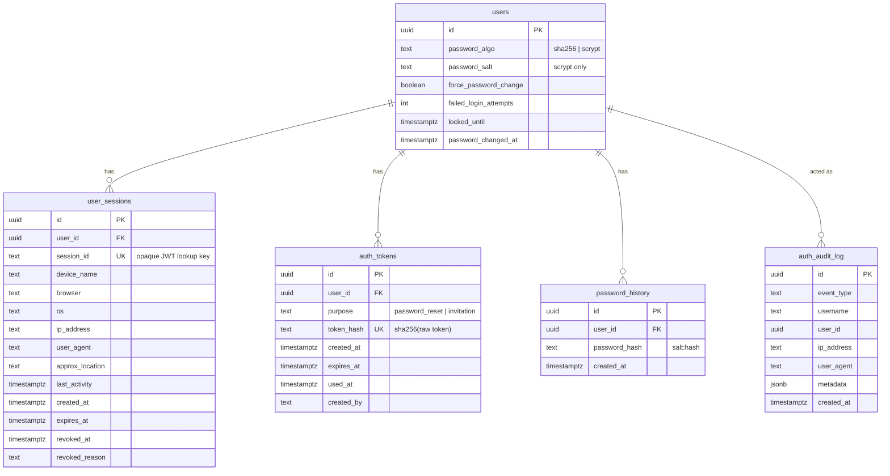
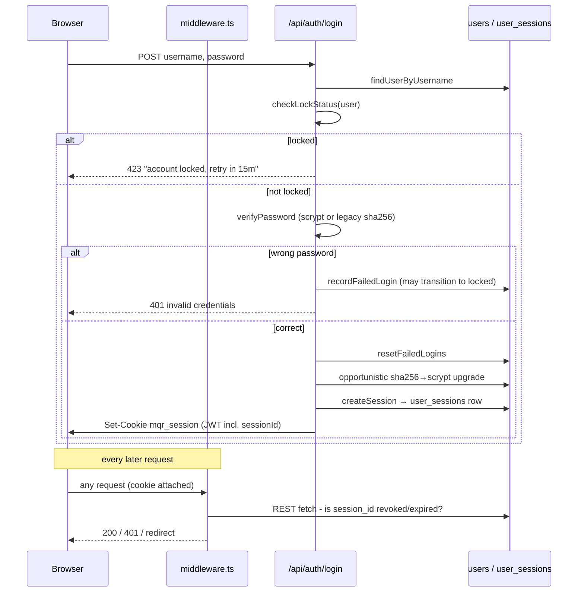
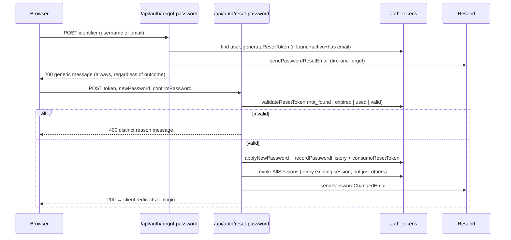
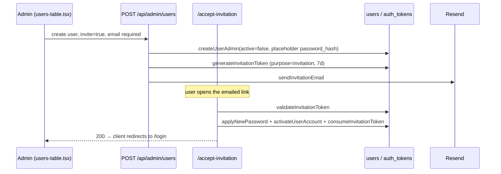

# Authentication Platform v3.0

The reopened, v3.0 evolution of the frozen Authentication Platform layer
(`docs/architecture/PLATFORM_CONSTITUTION.md`'s Foundation Freeze list).
Rationale for reopening it: `docs/adr/ADR-014-Authentication-Platform-v3.md`.

## Architecture summary

```
Browser
  │  mqr_session cookie (JWT: SessionUser + sessionId + forcePasswordChange)
  ▼
middleware.ts (Edge runtime)
  │  1. jwtVerify (signature/expiry)
  │  2. raw REST fetch → user_sessions row: revoked_at/expires_at check
  │  3. forcePasswordChange → gate everything except /change-password
  ▼
Route Handler / Server Component
  │  getSession() (lib/auth.ts) - re-verifies JWT, fire-and-forget
  │  touchLastActivity(sessionId)
  ▼
src/lib/authServices/*  ──────────────►  Supabase (users, user_sessions,
  sessionService / passwordService /        auth_tokens, auth_audit_log,
  passwordResetService / invitationService  password_history)
  / auditService
  │
  ▼
lib/email.ts (Resend) - Invitation / Password Reset / Password Changed /
                          Account Locked templates
```

No part of this reuses or duplicates `record_audit_log` (business-record
audit trail) or the Activity Timeline platform — this is a parallel,
account-security-scoped concern with its own table (`auth_audit_log`).

## Event model (`auth_audit_log`)

```ts
interface AuthAuditEvent {
  id: string;
  event_type:
    | 'LOGIN_SUCCESS' | 'LOGIN_FAILED' | 'ACCOUNT_LOCKED' | 'ACCOUNT_UNLOCKED'
    | 'PASSWORD_RESET_REQUEST' | 'PASSWORD_RESET_SUCCESS' | 'PASSWORD_CHANGED'
    | 'SESSION_CREATED' | 'SESSION_REVOKED' | 'SESSION_REVOKED_ALL'
    | 'USER_INVITED' | 'INVITATION_ACCEPTED' | 'FORCE_PASSWORD_CHANGE_COMPLETED';
  username: string | null;
  user_id: string | null;
  ip_address: string | null;
  user_agent: string | null;
  metadata: Record<string, unknown>;
  created_at: string;
}
```

`logAuthEvent()` (`lib/authServices/auditService.ts`) never throws — an
audit-log write failure must never break the auth action it describes,
the same contract `lib/email.ts`'s notification sends already use.

## ER diagram (new tables + `users` additions)



## Sequence diagrams

### Login (with lockout + Session Foundation)



### Forgot / Reset Password



### User Invitation



## API design

No generic public "Activity/Auth API" was introduced — every route above
is a thin, purpose-specific Next.js Route Handler under `/api/auth/*`
calling straight into the services above, matching every other route in
this codebase. `GET /api/auth/sessions` is the one read endpoint (Active
Sessions list), scoped to the caller's own `user_id` only — there is no
admin endpoint to list another user's sessions in this PR (an admin's
"force logout all sessions" acts blind, by user id, without seeing the
list first — a reasonable v1 limitation, not a security gap, since it
still requires `canForceLogoutAllSessions`).

## Extension points

- **New event types**: add to `AuthAuditEventType` in `auditService.ts` —
  purely additive, no redesign (matches how `ActivityEventType` in the
  Activity Timeline platform was designed for the same additive-only
  future).
- **New token purposes**: add to `auth_tokens.purpose`'s check constraint
  and a new `purpose` value — the generate/validate/consume shape is
  already generic across reset and invitation.
- **A future admin Sessions-across-users view**: `sessionService.ts`'s
  `listSessionsForUser(userId)` already exists; a new admin route would
  just call it with a different `userId`, gated by a new
  `canViewOtherSessions`-style predicate — no service change needed.

## Pagination / performance strategy

`listSessionsForUser()` has no pagination — a single user's active
session count is realistically small (this app has no "hundreds of
devices" use case). If that assumption ever breaks, the same
`.slice()`-based "Load more" pattern the Activity Timeline platform uses
is the documented fallback, not a redesign.

## Security review

| Area | Status |
|---|---|
| Password storage | Salted scrypt going forward; legacy sha256 rows upgrade opportunistically on next login. Never plaintext, never logged. |
| Reset/invitation tokens | `crypto.randomBytes(32)`, only `sha256(token)` stored, single-use, time-limited (30m / 7d). |
| Account enumeration | Forgot Password always returns the same generic message/shape, including on internal error - never distinguishes "not found" from "found." |
| Brute force (per-account) | 5 failed attempts → 15-minute lock, checked before password comparison; every attempt logged to both `login_log` and `auth_audit_log`. |
| Rate limiting (per-IP) | `rateLimitService.ts` - counts `auth_audit_log` rows by IP within a window (DB-backed, not in-memory, since Vercel serverless functions don't share memory across invocations). Login: 30 attempts/15m; Forgot Password: 5 requests/hour - catches distributed attempts across many usernames from one IP, which per-account lockout can't see. |
| Session revocation | Real, DB-backed, checked on every request via `middleware.ts` - not merely "wait for the JWT to expire." |
| CSRF | Custom-header check on every mutating `/api/*` request (Legacy Import explicitly, narrowly exempted - see ADR-014). |
| RBAC | Invite (`/api/admin/users` invite mode) and unlock (`/api/admin/users/[id]/unlock`) are gated by dedicated `scope.ts` predicates (`canInviteUsers`/`canUnlockAccounts`), checked server-side - never UI-only. `canForceResetPassword`/`canForceLogoutAllSessions` were added per spec section 13's RBAC list but are **not yet wired to any route** in this PR - see Remaining technical debt below. |
| Email enumeration via invite/reset | Both flows require the actor to already know a valid identifier or have admin access; neither leaks account existence beyond the deliberately-generic Forgot Password response. |

## Backward compatibility

- **Password verification**: `verifyPassword()` branches on `password_algo` - every existing `users` row (`password_algo` defaults to `'sha256'`) verifies exactly as it did before this PR; nothing is force-migrated. A row upgrades to `scrypt` only opportunistically, on its own next successful login.
- **No breaking schema change**: every new column is nullable or defaulted (`force_password_change boolean default false`, `failed_login_attempts int default 0`, etc.) and every new table is additive - no existing table/column is altered or dropped (11's Database Evolution Strategy discipline, applied here first).
- **Admin-set temporary passwords** (`/api/admin/users/[id]/reset-password`, pre-existing route) write a plain sha256 hash, matching the existing convention - and now explicitly reset `password_algo`/`password_salt` back to that legacy shape in the same write, so an account already opportunistically upgraded to `scrypt` is not left in an inconsistent, unrecoverable state after an admin resets its password (fixed during this PR's final production-readiness review - see `resetUserPassword()` in `lib/db.ts`).
- **One-time side effect on deploy**: every JWT issued before this PR ships has no `sessionId` claim. `middleware.ts` treats that as an invalid session, so **every currently logged-in user is signed out once, the first time they load any page after this deploys**, and must log in again (which immediately issues a session-backed JWT). This is expected, unavoidable given the session model change, and should be communicated to users/support ahead of the production deploy - it is not a bug.

## Remaining technical debt

1. No dedicated unit tests for `sessionService.ts`, `auditService.ts`, or
   most route handlers beyond `login/route.test.ts` (covered by live UAT
   instead - see ADR-014).
2. No admin UI to view another user's active sessions (only their own) -
   an admin's "force logout all" acts without a preview list.
3. Real geo-IP and multi-factor authentication are out of scope for this
   PR (see ADR-014's "Not changed" section). IP-based rate limiting
   *was* added (`rateLimitService.ts`) after being initially deferred.
4. Password expiration/minimum-age ship disabled by default - turning
   them on for real accounts (if ever needed) is a config change, not a
   code change, but has not been exercised against real user data.
5. The invited-but-not-yet-accepted state shows in the admin Users table
   as a plain "inactive" badge, identical to a manually-disabled account -
   a future enhancement could distinguish "pending invitation" visually.
6. `canForceResetPassword`/`canForceLogoutAllSessions` (`scope.ts`) are
   defined per spec section 13's RBAC list but have no route wired to
   them yet - the existing `/api/admin/users/[id]/reset-password` route
   uses `canManageUsers` (unchanged from before this PR), and there is no
   admin "force logout all of this user's sessions" route at all yet
   (only self-service `/api/auth/sessions/revoke-all` for one's own
   sessions). Extension point, not a gap in what shipped - see
   `AUTHENTICATION_PLATFORM.md`'s Extension points section above.
