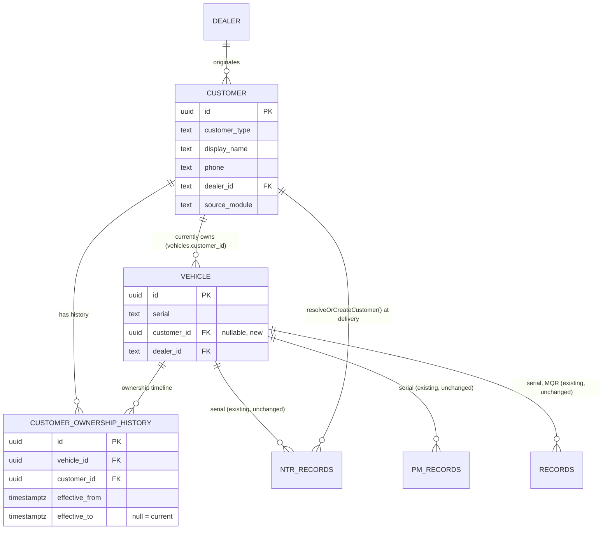

# Customer Ownership — Architecture Proposal (v3.1)

**Status: PROPOSED. Architecture only — no code, no schema, no migration
has been applied.** This document is the deliverable ADR-033 references;
ADR-033 records the decision, this document carries the design detail.

## Relationship to existing documents

Customer is not a new idea being invented here. It already exists in
four places, none of them built as a real entity:

- **Frozen Architecture Blueprint** ch.02 (Domain Model and Context Map)
  and ch.17 (Business Capability Map) already name Customer as one of
  the platform's bounded contexts, alongside Machine, Dealer, Service,
  Inspection, Knowledge, Engineering Intelligence, Analytics
  (`docs/governance/DOMAIN_OWNERSHIP_MATRIX.md` line 16).
- **Sprint-7 entity docs** (`docs/CORE_DOMAIN_MODEL.md`,
  `docs/ENTITY_MODEL.md` §3, `docs/ENTITY_RELATIONSHIP.md` §2) already
  spec a minimal `customers` table (`customer_id`, `customer_name`,
  `phone`, `address`), a nullable `Tractor.customer_id` FK, a
  Dealer → Customer → Tractor chain, and the rule "Customer is not a
  system user — no login, no Role." `docs/BUSINESS_WORKFLOW.md` §3
  names New Tractor Delivery's "Completed" stage as the transition that
  sets `customer_id`.
- **`docs/governance/DATA_OWNERSHIP_MATRIX.md`** already carries a full
  Customer row (Owner Domain, Source of Truth, Consumers, Update Rules,
  Relationships, Lifecycle) written against the same never-built
  `customers` table, and its own Gap Analysis already flags "Customer
  has no documented deletion/retention rule anywhere" — a real, still-
  open item this proposal does not resolve (see Risks).
- **`docs/architecture/MACHINE_DATA_OWNERSHIP.md`** (Machine Digital
  Passport, v1.2) documents, field by field, that Machine Passport's
  own Ownership panel (`MachineOwnershipPanel.tsx`) shows "Current
  Owner"/"Owner Phone" as a **read-time derived value from whichever of
  MQR/PM/NTR happens to be most recent for the serial** — no
  `customer_id` FK anywhere, no canonical Customer entity to de-
  duplicate against, and explicitly calls solving this "a Customer/
  Owner Identity Platform-sized decision, out of scope" for that PR.
  **This proposal is that decision.**

Nothing below invents a domain. It builds the entity four existing
documents already describe, reconciling their (untested, never-built)
1.0 spec against what the platform's five customer-capturing years of
production data actually need — the same reconciliation move ADR-017
made for Inspection against blueprint ch.04, and ADR-030 made for
Vehicle 360.

## Current state (verified against production schema, not memory)

Queried directly against the live schema
(`information_schema.columns`/`information_schema.tables`, project
`lhlzzxjayywqhqtjzfiu`):

| Table | Customer fields present | Field count |
|---|---|---|
| `ntr_records` | `customer_title`, `customer_first_name`, `customer_last_name`, `customer_name`, `customer_phone`, `customer_address`, `customer_subdistrict`, `customer_district`, `customer_province`, `customer_postal_code`, `customer_type`, plus two ID/tractor photo attachment columns | 11 data fields + 2 photo fields — the richest capture by far |
| `pm_records` | `customer_name`, `customer_phone` | 2 |
| `records` (MQR) | `customer_name`, `customer_phone` | 2 |
| `vehicles` | none | 0 — **no `customer_id` column exists today**, contrary to what a literal reading of `ENTITY_RELATIONSHIP.md`/`DATA_OWNERSHIP_MATRIX.md` might suggest; those documents describe the target, not the built state |

No `customers` table exists. No identity linking these three capture
points exists — the same customer visiting for NTR delivery, then a PM
service, then filing an MQR complaint is recorded as three unrelated
free-text name/phone snapshots, with no way to know it is one person or
to see their full machine/service history in one place.

**Already-reusable building blocks found** (Reuse-before-Build,
Constitution's Engineering Principles):

- `shared/master-data/lookup/customerType.ts` — `CustomerType`
  (`'Individual' | 'Company'`) lookup, single source of truth, already
  consumed by NTR.
- `shared/master-data/lookup/customerTitle.ts` — customer title/
  salutation lookup, same pattern.
- `shared/master-data/address/ThailandAddressResolver.ts` (ADR-022) —
  bottom-up Subdistrict → District → Province resolution with
  confidence/resolutionMethod, already handles Bangkok/abbreviation
  aliases. NTR's `customer_subdistrict`/`customer_district`/
  `customer_province`/`customer_postal_code` fields are exactly its
  input shape.
- `shared/master-data/MasterDataResolver.ts` (ADR-022) — ID → Exact
  Name → Alias → Unique Fuzzy Match resolution *pattern*. **Not reused
  directly**: it is deliberately read-only/never-creates by design
  (Dealer/Branch/Product Family are admin-managed reference data).
  Customer is operationally created at delivery, not admin-managed —
  the right precedent to follow is its resolution-method vocabulary and
  its "never guess on ambiguous, human decides" discipline, not the
  class itself. See Domain Model below.
- `src/features/vehicle/providers/registry.ts`'s
  `VEHICLE_SUMMARY_PROVIDERS = [NtrSummaryProvider,
  MaintenanceSummaryProvider, MqrSummaryProvider]` — the existing,
  order-significant, first-non-null-wins merge that already produces
  `ownerName`/`ownerPhone` today. This proposal extends it during a
  transition window rather than replacing it outright (Migration
  Strategy, below).
- `docs/standards/DOMAIN_LANGUAGE_STANDARD.md` already freezes
  "Customer"/"ลูกค้า" and "Owner"/"เจ้าของรถ" — no new terminology
  needed.

## Domain Model

**New bounded context: Customer**, owned by a new `src/features/
customer/` module (`types.ts`, `repository.ts`, `service.ts`,
`index.ts` — the same three-file shape every domain except MQR already
uses, per this repository's Service Construction Standard).

### `customers` (new table — the aggregate root)

```
id                  uuid pk default gen_random_uuid()
customer_type        text not null references CustomerType lookup ('Individual'|'Company')
customer_title        text null   -- reuses customerTitle lookup
first_name           text null
last_name            text null
display_name          text not null   -- full/company name, what every UI shows
phone               text not null
address              text null
subdistrict           text null
district             text null
province             text null
postal_code           text null
address_resolution_method text null  -- ThailandAddressResolver's own vocabulary, stored for audit
dealer_id             text null fk dealers.id   -- originating dealer, not an ownership constraint
source_module         text not null check in ('NTR','PM','MQR','Manual')  -- where this Customer was first captured/created
source_record_id       uuid null   -- the NTR/PM/MQR row that first created it, for traceability
created_by            text not null, created_at timestamptz default now()
updated_by            text null, updated_at timestamptz default now()
record_status         text not null default 'Active' check in ('Active','Deleted')
deleted_by            text null, deleted_at timestamptz null
```

Indexes: `phone`, `dealer_id`, `display_name` (trigram, for fuzzy
lookup). Every field name matches NTR's existing `customer_*` field
set 1:1 — no relabeling, no new vocabulary.

### `customer_ownership_history` (new table — closes `MACHINE_DATA_
OWNERSHIP.md`'s named "Owner History" gap)

```
id                 uuid pk default gen_random_uuid()
vehicle_id          uuid not null fk vehicles.id
customer_id          uuid not null fk customers.id
effective_from        timestamptz not null default now()
effective_to          timestamptz null   -- null = current owner
source              text not null check in ('NtrDelivery','ManualTransfer','Backfill')
reason              text null   -- required when source = 'ManualTransfer'
recorded_by           text not null, recorded_at timestamptz default now()
```

Append-only (no update, no delete) — an ownership transfer closes the
previous row (`effective_to`) and inserts a new one, the same event-
sourced-lite pattern this platform already uses for status transitions
elsewhere (never overwritten in place).

### `vehicles.customer_id` (new column, additive)

```
alter table vehicles add column customer_id uuid null references customers(id);
```

Nullable, exactly as `ENTITY_RELATIONSHIP.md` §2 already specified
("a Tractor can exist with `dealer_id` set and `customer_id` still
null" — pre-delivery/stock). Always the *current* owner; history lives
in `customer_ownership_history`, never as multiple non-null FKs.

### `CustomerService` (the one write path — Domain Principles' "One
Aggregate, One Owner, no repository ever joins across two bounded
contexts' tables")

- `resolveOrCreateCustomer(input, session)` — match by exact `phone`
  first (closest to a natural key for this platform's data); if no
  exact match, surface unique fuzzy name+phone candidates
  (Levenshtein, same "unique or don't guess" rule
  `MasterDataResolver` already applies) for the calling module to
  confirm; **never auto-merges on an ambiguous match** — a human
  confirms, or a new Customer row is created. This is the one place in
  the platform allowed to write `customers`.
- `getCustomerById(id, session)`, `searchCustomers(query, session)`
  (phone/name, dealer/branch-scoped).
- `getOwnershipHistory(vehicleId, session)` — reads
  `customer_ownership_history`, closes the Passport's named gap.
- `transferOwnership(vehicleId, newCustomerId, reason, session)` —
  gated by a new `canTransferOwnership` scope predicate (same shape as
  `canApproveDelivery`: SuperAdmin/CentralAdmin/DealerAdmin only).
  Closes the current history row, opens a new one, updates
  `vehicles.customer_id`, emits `OwnershipTransferred` through the
  **existing** `VehicleEventPublisher` (no new event mechanism).

No other module ever writes `customers` or `customer_ownership_history`
directly — NTR/PM/MQR call `CustomerService.resolveOrCreateCustomer()`,
they never construct a row themselves.

## Ownership Model

| Domain | Owns | Reads (via facade only) |
|---|---|---|
| **Customer** (new) | `customers`, `customer_ownership_history` | Nothing outside itself |
| Machine | `vehicles` (incl. the new `customer_id` column — Machine still owns the column, Customer owns what it points to, same split Dealer/Branch already has) | `CustomerService.getCustomerById()` for Passport display |
| NTR | `ntr_records` (`customer_*` columns **unchanged, kept**) | Calls `CustomerService.resolveOrCreateCustomer()` at delivery completion |
| PM, MQR | Their own `customer_name`/`customer_phone` columns (**unchanged, kept** — historical snapshot of who was on file at that visit) | No change required; may optionally call `resolveOrCreateCustomer()` in a later phase (not this one) |

This matches Domain Principles' "One Owner" exactly: Customer has
exactly one owner going forward, and no existing domain's table is
touched beyond one additive column on `vehicles`.

## Relationships (ER Diagram)



`NTR_RECORDS`/`PM_RECORDS`/`RECORDS` keep their own denormalized
`customer_name`/`customer_phone` columns (dotted relationship above is
conceptual only — no FK is added to those three tables in this
proposal; see Impact Analysis).

## Migration Strategy

Additive-only, four phases, each independently reversible until the
next begins:

1. **Schema** (separate implementation PR, after this proposal is
   approved): create `customers`, `customer_ownership_history`, add
   `vehicles.customer_id` nullable. Zero existing column touched.
2. **Backfill** (script, human-reviewed, not auto-applied): for every
   vehicle, walk its records in the **same precedence order the
   existing `VEHICLE_SUMMARY_PROVIDERS` registry already uses** — most
   recent NTR record first, then most recent PM record, then most
   recent MQR record — to seed one `customers` row (`source_module`
   set accordingly) and one `customer_ownership_history` row
   (`source: 'Backfill'`), then set `vehicles.customer_id`. Where a
   vehicle's own NTR/PM/MQR records disagree on customer name/phone
   across visits (a real, expected case — ownership does change hands,
   and free-text data has typos), the backfill **does not guess**: it
   flags the vehicle in a review report for a human to resolve, exactly
   the "never auto-merge on ambiguous" rule `CustomerService` itself
   enforces going forward. Nothing is silently picked.
3. **Dual-run** (one release): `NtrSummaryProvider`/
   `MaintenanceSummaryProvider`/`MqrSummaryProvider` keep contributing
   `ownerName`/`ownerPhone` exactly as today, but the registry gains a
   new, **first-priority** `CustomerOwnerProvider` reading
   `vehicles.customer_id` → `customers.display_name`/`phone` — first-
   non-null-wins means a backfilled vehicle now shows its authoritative
   owner, and a not-yet-backfilled or genuinely customer-less vehicle
   (pre-delivery stock) falls through to the existing merge unchanged.
   No UI or API caller needs to change for this phase.
4. **Cutover** (separate PR, after backfill is verified complete and
   the review report's ambiguous cases are resolved): remove the NTR/
   PM/MQR fallback contributions of `ownerName`/`ownerPhone` from the
   registry (their `customer_*` columns are **not** dropped — they stay
   as historical per-visit snapshots forever, per this platform's
   "additive-only, never a breaking rename" deprecation rule,
   `API_GOVERNANCE.md`). `MachineOwnershipPanel`'s "Owner History" row
   goes from "not available" to a real, populated list.

## Backward Compatibility

- No existing column is dropped, renamed, or repurposed. `ntr_records`/
  `pm_records`/`records`'s `customer_name`/`customer_phone` columns are
  permanent historical fields, not superseded.
- No existing API response shape changes. `VehicleSummary.ownerName`/
  `ownerPhone`'s type (`string | null`) is unchanged; only its source
  gains a new, higher-priority contributor.
- No existing NTR/PM/MQR create/update route's request contract
  changes. The one new behavior (`resolveOrCreateCustomer()` call) is
  additive server-side logic inside NTR's delivery-completion path, not
  a new required field on any existing form.
- `CustomerService.resolveOrCreateCustomer()` never overwrites an
  existing `customers` row's data from a later NTR/PM/MQR visit
  automatically — a customer's address changing on a later visit is a
  data-correction decision, not an automatic overwrite (mirrors
  Knowledge Principles' "Confidence is manual only" discipline: an
  identity match is confirmed by evidence, not silently mutated by it).

## Impact Analysis

### API Impact

New, additive only:
- `POST/GET /api/customers` (search/list, dealer/branch-scoped)
- `GET /api/customers/[id]`
- `GET /api/vehicles/[id]/ownership-history`
- `POST /api/vehicles/[id]/transfer-ownership` (gated by
  `canTransferOwnership`)

Unchanged: every existing NTR/PM/MQR/vehicle-summary/Machine Passport
route. `GET /api/machines/[machineId]` gains richer, not different,
`ownerName`/`ownerPhone`/(new) `ownerHistory` data once Phase 3/4 land.

### Database Impact

2 new tables, 1 new nullable column, 0 dropped/renamed columns, 0
existing FK changed. Both new tables get RLS + dealer/branch
application-layer scope, matching every other table in this platform
(Constitution's Data Principles — "neither layer is sufficient alone").

### UI Impact

`MachineOwnershipPanel.tsx`'s "Owner History" row becomes real (no new
screen required for that). No new nav-visible screen is proposed in
this phase — a full Customer 360/CRM search-and-profile UI is Roadmap
v3.1's own stated *next* increment after this foundation, not part of
"Customer Ownership" itself, matching the original milestone brief's
"architecture hardening first" framing carried over from ADR-032.

### Workflow Impact

NTR's existing delivery-completion workflow gains exactly one
additional server-side step: resolve-or-create the Customer and set
`vehicles.customer_id`, fulfilling `docs/BUSINESS_WORKFLOW.md` §3's
original (never-implemented) design — "Delivery is the workflow that
establishes the Dealer → Customer → Tractor relationship." No new user-
facing step, no new required field — NTR's form already captures every
field the Customer entity needs.

## Risks

1. **Data quality on backfill.** Free-text `customer_name`/
   `customer_phone` has five years of typos, format drift, and shared
   family phone numbers. Mitigation: exact-phone-first matching, unique-
   fuzzy-only acceptance, and a human-reviewed exception report for
   every ambiguous vehicle — never a silent best-guess merge.
2. **PII / retention — genuinely unresolved, not solved by this
   proposal.** `docs/governance/SECURITY_BOUNDARY.md` already
   classifies Customer name/phone as a direct identifier with **no
   documented retention/deletion rule anywhere in the platform today**.
   Building a real, queryable, cross-referenced Customer entity makes
   this gap materially more consequential than three scattered free-
   text columns did. **Recommendation: Legal/Compliance review and a
   named retention policy must land before Phase 1 (schema) ships**,
   not after. This proposal does not invent a retention policy — that
   is a business/legal decision outside engineering's authority to set
   unilaterally, consistent with this Constitution's "Honesty over
   completeness" value.
3. **Dual-source-of-truth window.** Between Phase 3 (dual-run) and
   Phase 4 (cutover), two sources of "current owner" coexist by design.
   Mitigation: Phase 4 is explicitly gated on backfill completion +
   review-report resolution, not a fixed calendar date.
4. **Machine is a Foundation-Freeze-adjacent aggregate root** (Blueprint
   ch.20's 5 Architecture Freeze items include "Machine-as-aggregate-
   root"). Adding a nullable `customer_id` column does not change
   `vehicles`' aggregate-root status or its identity, but it is still a
   schema change to a frozen-adjacent table — this should go through
   the same explicit-reopening discipline ADR-011/ADR-014 already used
   for their own frozen layers, not be treated as a routine additive
   migration just because the column is nullable.
5. **Constitution phrasing tension (named, not a violation).** The
   Constitution's Domain Principles state "Machine is the center of the
   platform... every bounded context either belongs to a Machine,
   describes an interaction with a Machine, or exists to help an
   engineer understand a Machine faster." Customer inverts this
   locally — a Customer owns many Machines, not the reverse — the same
   way Dealer already does. Not a violation (Dealer is precedent), but
   worth naming explicitly rather than silently reinterpreting the
   Constitution's wording; a future Constitutional amendment could
   clarify that Machine-centricity describes the platform's *primary*
   entity, not a claim that literally every entity is Machine-
   subordinate. Not amended here — amendments require the full process
   in `PLATFORM_CONSTITUTION.md`'s Constitutional Amendments section,
   out of this proposal's authority.

## Rollout Strategy

- **This PR**: architecture only. ADR-033 + this proposal. No code, no
  migration applied, no merge.
- **If approved**: one implementation PR for Phase 1+2 (schema +
  backfill script, review report generated but not auto-applied),
  requiring the Legal/Compliance sign-off named in Risk 2 before it is
  opened, per Constitutional Governance Principles ("a capability
  without Owner/Lifecycle/Permission/Status... is not yet real").
- **Second implementation PR** for Phase 3 (dual-run provider,
  `CustomerService` write path, new API routes, `canTransferOwnership`
  predicate), only after Phase 1+2's backfill report is reviewed and
  its ambiguous cases resolved by a human.
- **Third, later PR** for Phase 4 (cutover — remove NTR/PM/MQR fallback
  contribution), gated on Phase 3 running clean in production for a
  full billing/reporting cycle, not on a fixed date.
- Each phase is its own PR, its own review, its own explicit approval —
  matching this repository's own "capabilities evolve deliberately,
  never all at once" practice for every prior domain (Knowledge,
  Delivery, Inspection all shipped this way).

## Recommendation

**PROCEED**, conditional on:

1. Legal/Compliance review and a named PII retention policy landing
   before the Phase 1 schema PR is opened (Risk 2) — this is a
   precondition on the *next* PR, not on approving this architecture.
2. Explicit human approval of this design (per the Constitution's
   Capability Principles — a new domain needs Owner/Lifecycle/
   Permission/Status before it is considered real) before any schema or
   code is written.
3. The backfill's human-reviewed exception report is treated as a real
   gate on Phase 4 cutover, not a formality.

No redesign of Vehicle, Machine Passport, Import Inspection, NTR, PM,
Warranty, or MQR is required or proposed. Every reuse point identified
(`CustomerType`, `customerTitle`, `ThailandAddressResolver`, the
`VEHICLE_SUMMARY_PROVIDERS` registry, the resolution-method vocabulary
from `MasterDataResolver`) is composed, not copied. This closes a gap
four existing documents already named and left open, rather than
opening a new one.
