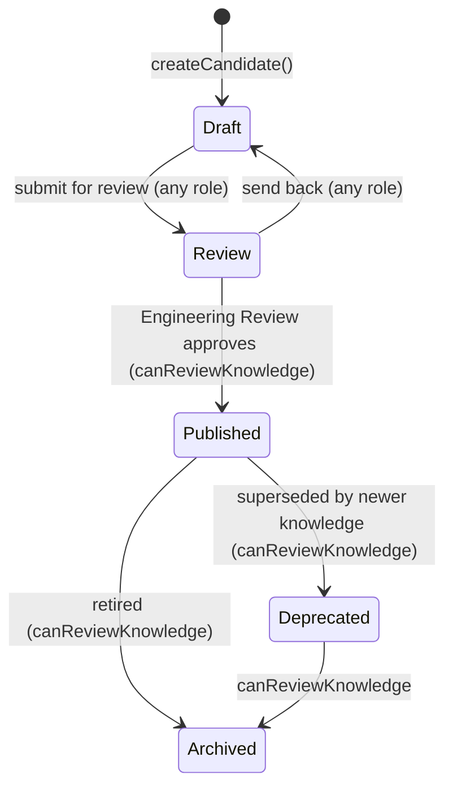

# Engineering Knowledge Platform (ADR-018)

Decision record: `docs/adr/ADR-018-Knowledge-Model.md`. This document is
the requested deliverables in one place, kept in sync with the code the
same way `IMPORT_PLATFORM.md` tracks ADR-022 and `MSEAL_DESIGN_FRAMEWORK.md`
tracks ADR-023. It refines, and does not restate or contradict,
`docs/architecture/blueprint/07-KNOWLEDGE-DOMAIN-AND-GRAPH.md` ("ch.07",
frozen Architecture Baseline) - see §9 for the exact relationship.

**Relationship to existing documents**: ch.07 is the frozen origin of the
Knowledge domain concept (bounded context, ownership boundary,
`KnowledgeService` shape). This document is the living, implementation-
level detail for the actual build - schema, API, screens, governance.
Where the two disagree on a specific value (stage names, confidence
representation), this document's ADR-018 table (§9) is authoritative,
per the user-approved reconciliation.

This is the first capability built after Foundation Freeze v1.0, which
named "Knowledge Engine v1.0" as the recommended next epic
(`docs/releases/FOUNDATION_FREEZE_v1.0.md`).

---

## 1. Engineering Knowledge Architecture

Knowledge is a first-class business domain - not owned by Quality, PM,
Warranty, or Machine. It aggregates **Evidence** from every domain and is
the one thing Engineering Intelligence (future, Coming Soon) is allowed
to read; Engineering Intelligence never reads raw Quality/PM/Warranty
data directly (ch.07's "Open Host Service" rule, unchanged by this ADR).

```
Quality Report -> Troubleshooting -> Knowledge Candidate -> Engineering Review
   -> Knowledge Case -> Engineering Intelligence -> PIP -> Predictive Quality
```

"Knowledge Candidate" and "Knowledge Case" in that flow are **the same
database row** at different points of its `maturity` (§3) - not two
tables, not a promotion/copy step (ADR-018, resolved with the user
explicitly).

New feature module: `src/features/knowledge/` (`types.ts`, `repository.ts`,
`service.ts`, `index.ts`, `components/`) - `KnowledgeRepository` owns
`knowledge_cases`/`knowledge_evidence`; `KnowledgeService` is the one door
every caller (API routes, `MachineService`, a future Engineering
Intelligence) goes through - matching ch.07's explicit shape and its
rule that the repository is "never queried directly by Engineering
Intelligence/Analytics."

## 2. Knowledge Domain Model

One aggregate, two tables:

**`knowledge_cases`** - `id`, `case_ref` (business-facing `KNOW-<year>-######`,
via the existing `next_job_seq()` RPC with a fixed global bucket key
`'KNOW:GLOBAL'` - a deliberate deviation from `DATABASE_STANDARD.md`'s
per-dealer bucket convention, since Knowledge is platform-shared
reference data, not a dealer-owned transactional record), `dealer_id`
(nullable, attribution only - never used to scope reads, matching
`problem_codes`), `symptom`, `affected_system`, `product_family_id` +
`model` (ch.07's `machine_context` - deliberately family/model, never a
machine serial, so a case generalizes across machines of the same type),
`possible_causes` (jsonb array), `validated_fix`, `verification_steps`
(jsonb array), `confidence` (§5), `maturity` (§3), `superseded_by_case_id`,
plus the standard audit/soft-delete columns every table in this platform
carries.

**`knowledge_evidence`** - `id`, `knowledge_case_id` (FK, cascade),
`source_type` (Quality/PM/Warranty/Machine/Dealer/Customer/Engineer/IoT -
IoT reserved, no producer yet), `source_module`/`source_record_id`
(optional link to a real MQR/PM/NTR record), `machine_serial`
(denormalized on purpose - see §4), `author`, `observed_at`, `confidence`
(optional, per-evidence), `summary`, plus standard audit/soft-delete
columns.

This is how "Related Machines/Quality Reports/PM/Warranty" are satisfied
**without ever giving `knowledge_cases` a primary FK to one module's
table** - the single most important rule ch.07 states: *"if a 'Knowledge'
table ends up with a foreign key to `records.id` ... it has silently
become MQR's knowledge, not the platform's."* `KnowledgeService.getCase()`
derives every "Related X" list from that case's own evidence rows.

RLS: permissive (`USING (true)`), matching `problem_codes`/
`product_families` - Knowledge is platform-wide readable reference data,
not per-dealer transactional data. Real write authorization is enforced
in `KnowledgeService`/the API routes (§7), matching this platform's
existing "RLS + mandatory application-layer scoping, both required"
model (`SECURITY_STANDARD.md`).

## 3. Knowledge Lifecycle

Two distinct concepts, per ch.07's own explicit warning ("Knowledge
Confidence != Knowledge Maturity... conflating them is a real risk"),
extended here to also separate the **business-flow narrative** from the
**stored workflow state**:

- **The business flow / process narrative** (documentation only, not a
  stored field): `Observed -> Candidate -> Engineering Review -> Validated
  -> Published -> Superseded -> Archived`. This describes *how a symptom
  becomes trusted knowledge* - an evidence-gathering phase (Observed), a
  Draft/Review-maturity record a technician can already see and add to
  (Candidate), the `Review -> Published` transition (Engineering Review),
  and the terminal states (Superseded/Archived). It is the same kind of
  diagram ch.07 itself calls "Knowledge Lifecycle" (Machine Event ->
  Observation -> ... -> Knowledge Improvement) - a narrative, not a
  second persisted state machine.
- **`knowledge_cases.maturity`** (the one real, stored workflow-state
  field): `Draft -> Review -> Published -> Deprecated -> Archived`.



"Candidate" (UI term) = `maturity IN ('Draft', 'Review')`. "Case" (UI
term) = `maturity IN ('Published', 'Deprecated', 'Archived')`. "Superseded"
(business-flow wording) = `maturity = 'Deprecated'` plus
`superseded_by_case_id` pointing at the newer case - one concept, two
names, never a sixth maturity value.

`KNOWLEDGE_MATURITY_TRANSITIONS` + `canTransitionKnowledgeMaturity()`
(`src/features/knowledge/types.ts`) mirror `MQR_STATUS_TRANSITIONS` +
`canTransitionMqrStatus()` (`src/lib/types.ts`) exactly - same shape, same
"same-state is a no-op," same SuperAdmin unconditional override.

## 4. Evidence Model

Every Evidence item records **Source** (`source_type`, one of the 8
values above), **Author** (`author`, the recording user's username),
**Date** (`observed_at`), **Confidence** (optional per-evidence level,
§5), and **Attachments** (via the existing, frozen Attachment Platform -
`AttachmentService.upload({ module: 'knowledge', entityType: 'evidence',
entityId: <evidence id> })`, zero new storage infrastructure).

`machine_serial` is denormalized directly onto the evidence row rather
than derived by joining back through MQR/PM/NTR - this is how "Related
Machines" and the Machine Passport's reverse lookup (§8) work with zero
coupling from `knowledge_cases` to any one module's table.

Evidence is always the Source of Truth - a Knowledge Case's `possible_causes`/
`validated_fix`/`confidence` are engineering *conclusions*; the Evidence
rows are the record of *why*. Nothing in this platform deletes evidence
when a case's conclusion changes (soft-delete only, same as every other
table).

## 5. Confidence Model

**Manual only. AI must never assign confidence.** Five levels: `VeryLow`,
`Low`, `Medium`, `High`, `Verified`. Stored identically on
`knowledge_cases.confidence` (the case's overall, engineer-set
assessment) and optionally on `knowledge_evidence.confidence` (an
individual piece of evidence's own reliability) - one shared TypeScript
type/DB `CHECK` constraint for both, never two independently-drifting
enums.

**Confidence = evidence quality, independent of Maturity = workflow
state** (the user's own explicit instruction, resolving the ch.07
conflict in §9). A Draft Candidate can already be `High` confidence if
the evidence is strong; a Published Case is not automatically `Verified`
just because it passed Engineering Review - Engineering Review moves
*maturity*, an engineer separately, deliberately sets *confidence* based
on the evidence quality they're looking at.

This does not weaken ch.07's authority rule - only an Engineer (via
`canReviewKnowledge`, `lib/scope.ts`'s `seesAllDealers` boundary) may move
maturity into Published/Deprecated/Archived, and confidence is a plain
field edit gated the same way once a case is Published (§7). AI has no
write path to either field anywhere in this codebase.

## 6. Knowledge Screen Contract

Three screens, all Quality-owned (`/quality/knowledge/*` - the existing
`nav.qualityKnowledge` Coming Soon entry now points here, no nav
restructuring):

**`/quality/knowledge` (list)** - Purpose: find a Knowledge Candidate/
Case by symptom, or triage what needs Engineering Review. Primary User:
Technician (browse/create), Engineer/Admin (review). Primary Decision:
"is there already validated knowledge for this symptom." Primary Action:
open a case, or create a new Candidate. Success Criteria: a technician
finds a relevant Published case before creating a duplicate one.
Permissions: every authenticated role may view/create (enforced
server-side by the API route, nav visibility is UX only). Navigation:
Quality > Knowledge (`nav.qualityKnowledge`). KPIs: none (a filter/search
list, not a dashboard). Quick Actions: "+ New Knowledge Candidate."
Timeline: none (list screen). Related Records: links to each case
detail. Future AI Panel: not applicable to a list screen.

**`/quality/knowledge/new` (create)** - Purpose: capture a new Knowledge
Candidate. Primary User: any role. Primary Action: submit symptom +
initial possible causes. Permissions: every role. Navigation: reached via
the list's Quick Action.

**`/quality/knowledge/[id]` (detail)** - Purpose: review/edit one case and
drive it through Engineering Review. Primary User: Technician (edit while
Draft/Review), Engineer/Admin (review, Published+ edits). Primary
Decision: "is this ready to publish." Primary Action: add Evidence, or
transition Maturity. Success Criteria: a case reaches Published with
real Evidence and a Validated Fix before it's trusted platform-wide.
Permissions: `canReviewKnowledge` (`lib/scope.ts`) gates every transition
into Published/Deprecated/Archived and any field edit once Published -
enforced server-side by `KnowledgeService`/the API routes, never only in
the UI. Navigation: reached from the list. KPIs: Maturity + Confidence
pills in the header. Quick Actions: role-filtered maturity transition
buttons (Submit for Review / Send Back to Draft / Approve & Publish /
Deprecate / Archive), "+ Add Evidence." Timeline: `<ActivityTimeline>`,
fed by `record_audit_log` (module `'knowledge'`) - zero component
changes, the shared timeline is already module-agnostic. Related
Records: Machines/Quality Reports/PM/Warranty (derived from Evidence,
§2) + Documents (case-level attachments). Future AI Panel: reserved,
4 Coming Soon tiles (AI Summary/Recommendation/Root Cause/Similar Cases,
§8 of `SCREEN_CONTRACT.md`) - see §8 of this document.

## 7. Knowledge Governance

- **RBAC**: `canReviewKnowledge` (`lib/scope.ts`) = `seesAllDealers` (
  SuperAdmin/CentralAdmin) - the same boundary as PM Record unlock/Email
  Health, not a new authorization model. Creating and editing a Candidate
  (Draft/Review) is open to every role - ch.07's "everyone who touches a
  Machine improves Knowledge" principle. Editing a Published case, or
  moving maturity into Published/Deprecated/Archived, requires
  `canReviewKnowledge` - enforced by `KnowledgeService`/the API routes,
  re-checked server-side every time (nav/button visibility is UX only,
  `SECURITY_STANDARD.md`).
- **Ownership**: Knowledge owns itself - an independent domain (§1),
  never subordinate to Quality, PM, Warranty, or Machine. Quality owns
  execution (Quality Cases, Troubleshooting) only. `TERMINOLOGY_STANDARD.md`'s
  and `MSEAL_DESIGN_FRAMEWORK.md` §2a's "Domain ownership" sections
  previously said Quality owned Knowledge too - a leftover from before
  this domain was real, corrected by this PR (final architecture review)
  since it directly contradicted §1's own Vision statement. Knowledge's
  nav entry sits under the Quality menu group for UX/discoverability
  only (the same place a technician already looks for Quality Cases/
  Troubleshooting), not because Quality owns its data. Engineering
  Intelligence consumes Knowledge, never owns a second copy. Machine
  never owns Knowledge (§8).
- **No duplicated ownership/timeline/widgets** (verified, §10): one
  `KnowledgeRepository` for both tables; the shared `record_audit_log` +
  `<ActivityTimeline>`, not a new timeline table/component; the shared
  Attachment Platform, not a new upload pipeline; `StatusPill` composed
  (via `MaturityPill`/`ConfidencePill`), not a new pill primitive.

## 8. Machine Integration

Machine still owns nothing (`MACHINE_DATA_OWNERSHIP.md`'s "the Passport
owns nothing" principle, unchanged). `MachineService.getMachineKnowledgeSummary(serial)`
is a thin new method delegating to `KnowledgeService.getKnowledgeForMachine(serial)`
- Published cases only, whose Evidence names this serial (via
`knowledge_evidence.machine_serial`, never a join back through
MQR/PM/NTR). Machine Passport v1.4 wraps this in its own
`<Suspense>` section (`MachineKnowledgeSection.tsx`, the same shape as
every other section since v1.0) and replaces the previously-static
"Knowledge Cases"/"Known Problems" tiles in `MachineKnowledgePanel.tsx`
with real data; "AI Recommendation," "Prediction," and "Knowledge Score"
remain Coming Soon (Knowledge Score is "concept only, not an
implementation" per ch.07; AI tiles per this build's explicit "do not
build AI" scope).

## 9. Architecture Notes

See `docs/adr/ADR-018-Knowledge-Model.md` for the full Problem/Decision/
Consequences record. Summary of the reconciliation between this brief's
own vocabulary and the already-frozen ch.07 model, resolved explicitly
with the user before any code was written:

| | ch.07 (before) | This build (after, ADR-018) |
|---|---|---|
| Storage | One `KnowledgeCase` entity | Unchanged - one `knowledge_cases` table |
| Candidate/Case | N/A | UI-only maturity-bucket names, same row |
| Maturity stages | Draft/Validated/Trusted/Best Practice/Retired | Superseded: Draft/Review/Published/Deprecated/Archived |
| Confidence | Continuous 0-1, computed | Superseded: discrete manual levels, evidence quality |
| Ownership principles | Never keyed off one module/machine; only Engineer moves confidence | Unchanged |

## 10. Production Readiness Recommendation

**PASS WITH WARNINGS.**

Verified: typecheck/lint/tests/build/architecture-check all pass (see PR
description for the actual run). Migrations additive-only, applied and
confirmed live. RLS enabled on both new tables. No duplicated timeline/
attachment/repository infrastructure (§7).

Warnings (explicitly deferred, not silently dropped):

- **AI Summary/Recommendation/Root Cause/Similar Cases** - reserved UI
  slots only, no implementation (this build's explicit scope boundary).
- **Knowledge Score** - "concept only" per ch.07, not computed.
- **The matching/clustering algorithm** behind a future `findSimilarCases`
  - ch.07 itself defers this to Engineering Intelligence.
- **Evidence attachment upload UI** - the data model and
  `AttachmentService`/`/api/attachments` route already support attaching
  a file to a specific Evidence item (`module: 'knowledge'`, `entityType:
  'evidence'`); the "Add Evidence" form's file picker is not wired in v1.
  Case-level "Related Documents" (`entityType: 'knowledge_case'`) *is*
  wired and viewable.
- **Bulk actions/export** on the Knowledge list - not built, matching
  every other v1 list screen in this platform that shipped without them
  first.
- **Hard-delete UI** for a Knowledge Case - soft-delete columns exist
  (`record_status`/`deleted_by`/`deleted_at`), no delete action wired.
- **IoT evidence ingestion** - `source_type = 'IoT'` is accepted by the
  schema and reserved; no producer exists.
- **Pagination on the Knowledge list** - not built in v1 (small expected
  row count); the same gap `TABLE_GUIDELINES.md` already notes platform-
  wide for `AdminCrudTable`.

None of these block Engineering Review, evidence capture, or Machine
Passport integration - the three things this epic's "foundation AI will
consume" goal actually requires.
