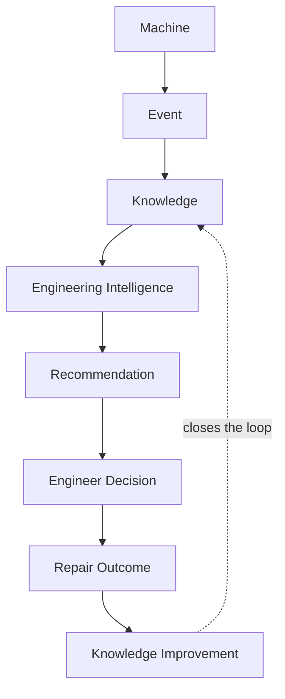

# 01 — North Star & Principles

## Mission

Turn every machine interaction into reusable engineering knowledge.

## Vision

Every machine interaction becomes knowledge. Every piece of knowledge
should help solve the next machine faster, more accurately, and with
higher confidence.

**MSEAL DMS is not a record management system. It is an Engineering
Intelligence Platform.**

## Platform

- **Platform name**: MSEAL DMS (`docs/architecture/blueprint` supersedes
  nothing here — branding is already centralized in `src/lib/branding.ts`;
  this document is about the *engineering* platform, not the brand string).
- **Platform goal**: capture data once, reuse it everywhere. Every module
  contributes reusable engineering knowledge instead of sitting as an
  isolated record store.

## Golden Rule

> The goal is not to build software that stores service records. The goal
> is to build a platform that continuously improves engineering decisions
> through reusable knowledge.

Every other document in this blueprint is a restatement of this rule at
a different layer of the system — the Domain Model (02) says which
entity everything hangs off; the Event Model (06) says how a fact
becomes visible platform-wide the moment it happens; the Knowledge Domain
(07) says how facts become reusable judgment; the Engineering Intelligence
Domain (08) says how that judgment gets surfaced back to an engineer,
without ever replacing them.

## Platform Philosophy

> Every machine has a history.
> Every history creates knowledge.
> Every piece of knowledge improves engineering.
> Every engineering decision improves the next machine.

This is the Golden Rule restated as a chain of custody, not a slogan —
each line above is a named handoff between two sections of this
blueprint: "history" is the Machine Timeline (03), "knowledge" is the
Knowledge Domain (07), "engineering" is the Engineering Intelligence
Domain (08) surfacing that knowledge to an engineer, and "the next
machine" is the Knowledge Score (07)/Machine Digital Passport (10) of
whatever machine benefits from it next. No line in this chain is
optional — a platform that captures history but never turns it into
Knowledge, or turns it into Knowledge that never reaches an engineer, has
broken the chain silently, even if every individual module still works.

## Engineering Knowledge Loop

This is the same loop as 07's Knowledge Lifecycle diagram, drawn at
platform scale rather than per-case: **every** phase in the Roadmap (13)
either builds one arrow in this loop or strengthens an existing one —
that is the test for whether a proposed feature belongs in this platform
at all. A feature that cannot be placed on this diagram is very likely
the isolated-module anti-pattern Principle 9 warns against.

## Architecture Principles

1. **Machine is the primary entity.** Every domain either belongs to a
   Machine, describes an interaction with a Machine, or exists to help
   engineers understand a Machine faster. See 02.
2. **Everything important is an Event.** A fact is not "done" once it's
   saved to a table — it's done once it's emitted as an event other
   domains (Timeline, Knowledge, Analytics, AI) can consume without
   coupling to the table that produced it. See 06.
3. **Every Event creates Knowledge.** Not every event is *interesting*
   knowledge on its own, but every event is a candidate observation the
   Knowledge domain can fold into a case. See 07.
4. **Knowledge continuously improves AI.** The Engineering Intelligence
   domain has no independent data of its own — it is a consumer of
   Knowledge, never a second source of truth. It exists to support
   *engineering* decisions specifically, not general business
   intelligence — see 08's naming rationale. See 08.
5. **Everyone who touches a Machine continuously improves Knowledge.**
   Feedback (did this recommendation work? was this root cause right?) is
   itself an event that updates Knowledge's confidence — the loop closes
   back to humans, not around them. Feedback is no longer engineer-only:
   Technician, Dealer, and Customer feedback all feed Knowledge too, with
   Engineer Validation remaining the one step that can actually raise a
   Knowledge Case's confidence. See 07's Human Feedback Loop.
6. **AI assists engineers. AI never replaces engineering judgment.** See
   08's AI Governance — a hard boundary, not a tuning parameter.
7. **Every recommendation must be explainable.** No output from the
   Engineering Intelligence domain is ever a bare score — it always
   carries the reasoning that produced it, and its confidence is
   presented per 08's AI Confidence Policy, never as a raw number alone.
8. **Every recommendation must be traceable.** Every recommendation
   resolves back to the source events and knowledge records that
   produced it, on demand, not just in an audit log no one reads.
9. **Capture data once. Reuse it everywhere.** The test for "should this
   be a new isolated table" is always: could this instead be an event a
   shared domain already understands?

## Engineering Principles

Every new feature proposal — in this blueprint or after it — must be able
to answer, in the design itself, before a line of code is written:

1. **What Machine is involved?**
2. **What Event is created?**
3. **What Knowledge is created?**
4. **How will AI use it?**
5. **How will Timeline display it?**
6. **How will Analytics consume it?**

If these cannot be answered, the design is incomplete — not "acceptable
for a v1," incomplete. A feature that can't name its Machine, Event, or
Knowledge contribution is very likely about to become the next isolated
module this platform is explicitly trying to avoid.

## Success Metrics

The blueprint is only worth building if these move, and they are the
metrics every phase in Section 13 should be evaluated against — not
feature-count or lines-of-code:

| Metric | What it measures |
|---|---|
| First-time Fix Rate | Repairs that resolve the complaint without a repeat visit |
| Mean Diagnosis Time | Time from complaint/symptom to confirmed root cause |
| Mean Repair Time | Time from confirmed root cause to repair completion |
| Repeat Failure Rate | Same machine, same symptom, within a defined window |
| Machine Downtime | Aggregate time a machine is out of service |
| Warranty Cost | Total warranty spend, trended by product/dealer/failure mode |
| Parts Prediction Accuracy | Predicted-vs-actual parts required for a given symptom/repair |
| AI Recommendation Acceptance | How often an engineer accepts vs. overrides an AI recommendation |
| Dealer Technical Capability | Dealer-level first-time-fix/diagnosis-time trend |
| PIP Effectiveness | Repeat-failure-rate reduction attributable to a shipped PIP |
| Customer Satisfaction | Whatever CSAT/NPS mechanism the business already uses, correlated against the above |

None of these require a new metric-collection mechanism invented from
scratch — every one is derivable from the Event Model (06) once each
domain emits the events Section 06 defines. This is itself a test of the
architecture: if a success metric can't be computed from events already
being emitted, the Event Model is missing something, not the metric.
