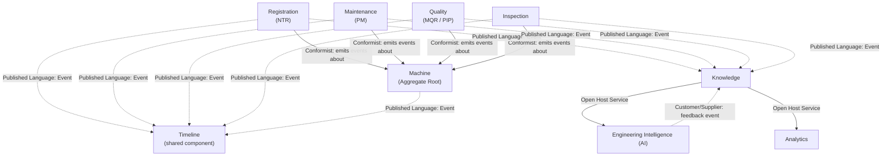

# 02 — Domain Model & Context Map

**Out of scope for this document**: no table is renamed, no repository
class is introduced yet. Everything below is a target design; the
"Today" column in every table is the actual current state of this
codebase.

## Core Domains

| Domain | Responsibility |
|---|---|
| Machine | The aggregate root — a physical unit sold/serviced through the platform |
| Customer | Who owns/operates a Machine |
| Dealer | Who sells/services a Machine on the manufacturer's behalf |
| Service | The operational modules that touch a Machine (Registration/NTR, Maintenance/PM, Warranty, Parts, Quality) |
| Inspection | Structured, timestamped evaluations of a Machine's condition (own domain — see 04) |
| Knowledge | Reusable engineering judgment distilled from events (see 07) |
| Engineering Intelligence | AI decision support for *engineering* decisions specifically, consuming Knowledge — not general business intelligence, see 08's naming rationale (see 08) |
| Analytics | KPIs/dashboards/reports consuming Knowledge, not operational tables (see 09) |

## Domain Model

```
Machine (Aggregate Root)
├── Registry        — identity: serial, model, product category, dealer, delivery date
├── Timeline         — every lifecycle event, newest first (single source of truth — see 03)
├── Inspection       — PDI/QA/Warranty/Annual inspections (own domain — see 04)
├── Ownership        — current + historical owner(s), transfer events
├── Documents        — business documents (PDF reports, certificates) tied to this Machine
├── Configuration    — product family/model/variant, options, as-built spec
└── Attachments      — photos/videos, via the existing Attachment Platform (ADR-010)

Customer   — 1 Customer : N Machines (current + historical, via Ownership)
Dealer     — 1 Dealer : N Machines (current servicing dealer, via DealerBranchScope)
Service    — N Service records : 1 Machine (NTR/PM/Warranty/Parts/MQR/PIP, each a bounded context of its own — see 05)
Knowledge  — N Knowledge records : N Machines (a case is not owned by one machine once distilled — see 07)
Analytics  — reads Knowledge + Events, owns no operational data of its own
```

### Today vs. target

| Concept above | Today | Target |
|---|---|---|
| Machine (Aggregate Root) | `vehicles` table, `Vehicle` type in `lib/types.ts`, aliased to `Machine` in `features/machine/types.ts` (ADR-009) | Same table, formally documented as the aggregate root every other domain references by `machine_id`/serial — no rename |
| Registry | `vehicles` columns + Tractor IN sync (`tractorInSyncService.ts`) | Unchanged — already exactly this |
| Timeline | Per-module ad hoc history (Activity Timeline platform, shipped for MQR; `getVehicleTimeline`/`MachineService.getMachineTimeline`) | Every module's events flow through one generic Timeline component (already built — `components/shared/activity-timeline/`) fed by the Event Model (06), not a per-module bespoke query |
| Inspection | Embedded implicitly inside NTR's delivery flow (no first-class inspection record) | New, additive `inspections` table + `InspectionService` (04) |
| Ownership | `records`/`ntr_records` free-text customer fields; no formal transfer-history table | New, additive `machine_ownership_history` table (11) |
| Documents | Per-module PDF/Excel export (`exportPdf.tsx`, `ntrPdf.tsx`, `maintenancePdf.tsx`) | Unchanged generation logic; documents become linkable Timeline/Machine Profile entries, not just download buttons |
| Configuration | `product_families`/`product_family_models`/`vehicles.product_family_id`/`sub_model` | Unchanged — already exactly this |
| Attachments | Attachment Platform (ADR-010), already module-agnostic | Unchanged — already exactly this |

## Bounded Contexts

Each bounded context below already maps to (or should map to) one
`src/features/<name>/` folder, matching this repo's existing module
boundary convention (`.claude/rules/01-architecture-boundaries.md`):

| Bounded Context | Today's folder | Owns |
|---|---|---|
| Machine | `features/machine/` (facade over `features/vehicle/`) | Registry, Timeline aggregation, Machine 360 |
| Registration | `features/ntr/` | NTR record lifecycle |
| Maintenance | `features/maintenance/` | PM record lifecycle |
| Quality | `features/mqr/` (provider) + `src/app/(app)/records` | MQR record lifecycle |
| Inspection | *(new)* `features/inspection/` | Inspection records across all inspection types (04) |
| Knowledge | *(new)* `features/knowledge/` | Knowledge cases, confidence, feedback (07) |
| Engineering Intelligence | *(new)* `features/engineering-intelligence/` | AI recommendation requests/responses, never raw model calls from a UI route (08) |
| Analytics | *(new)* `features/analytics/` | KPI/dashboard computation, reading only Knowledge + Events (09) |

**Rule, unchanged from today**: a bounded context may import from
`shared/`/`lib/`; it must never import another bounded context's
internals directly. Cross-context reads go through that context's own
public service (`MachineService`, a future `KnowledgeService`, etc.) —
exactly the pattern `MachineService` already uses to read
MQR/PM/NTR "records for this serial" through each module's own scoped
utility, never a raw query of another module's table.

## Context Map (DDD)



- **Conformist**: Registration/Maintenance/Quality/Inspection each
  conform to the Machine aggregate's identity (serial/machine_id) — they
  never redefine what a Machine is.
- **Published Language**: the Event Model (06) is the shared vocabulary
  every context publishes into; Timeline and Knowledge are both
  consumers of the same events, never of each other.
- **Open Host Service**: Knowledge exposes a stable read API that
  Engineering Intelligence and Analytics both consume — neither ever
  queries Knowledge's internal storage directly. This is the
  `Knowledge → Engineering Intelligence → Analytics` pipeline named in
  08's naming rationale, drawn here as the formal Context Map
  relationship.
- **Customer/Supplier**: Engineering Intelligence depends on Knowledge
  (supplier) for its recommendations, and feeds stakeholder feedback
  (07's Human Feedback Loop) back as a new event — it is a customer of
  Knowledge, never the other way around.

## Aggregate Roots

| Aggregate Root | Identity | Owns (inside its own consistency boundary) |
|---|---|---|
| **Machine** | `serial` (today) / `machine_id` (target — see 11) | Registry, Configuration, Ownership, Attachments |
| **Service Record** (NTR/PM/MQR/PIP, one per context) | Its own module ID (`job_id`, PM number, etc.) | Its own module's fields — never Machine's fields, only a reference to `machine_id` |
| **Inspection** | Inspection ID | `inspection_type`, result, performer, photos — references `machine_id` |
| **Knowledge Case** | Case ID | Symptom, cause, resolution, confidence, source-event references |

A Service Record is **not** part of the Machine aggregate — it references
Machine by ID and emits events about it, matching how `record_audit_log`
already treats `mqr`/`pm`/`ntr` as sibling modules today, not
sub-entities of one giant record.

## Repository Boundaries

Continuing the facade convention ADR-009 already established
(`MachineRepository` wraps `lib/db.ts`'s vehicle functions rather than
introducing a parallel data-access path):

- **MachineRepository** — the only reader/writer of Machine identity
  data. Every other context reads Machine data through it, never a raw
  `vehicles` query of its own (already mostly true; formalizing it means
  auditing remaining direct `vehicles` reads outside `lib/db.ts`/
  `features/machine/` — tracked in 14).
- **Per-context repositories** (`supabaseNtrRepository`,
  `supabaseMaintenanceRepository`, a future `InspectionRepository`,
  `KnowledgeRepository`) — each owns exactly its own context's tables,
  same as today.
- **No repository ever joins across two bounded contexts' tables in one
  query.** Cross-context data assembly happens in a service layer
  (`MachineService`-style aggregation), not in SQL — this is already the
  pattern `MachineService.getMachineAttachments()` uses (three parallel
  per-module fetches, merged in application code, not a SQL join).
