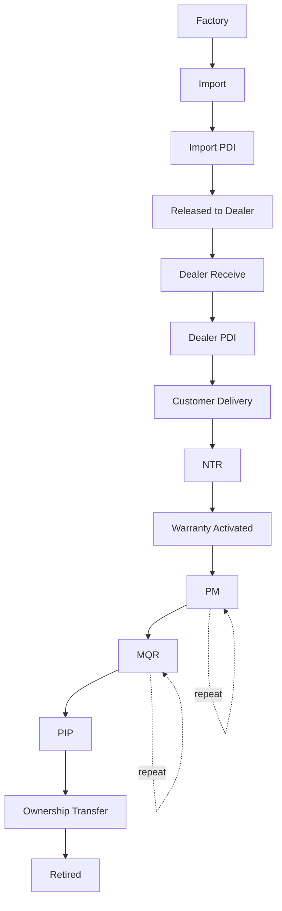

# 03 — Machine Lifecycle & Timeline

> **Amendment (ADR-027, Machine Delivery Platform)**: this chapter's two
> named gaps are closed by `docs/architecture/DELIVERY_PLATFORM.md`.
> "Customer Delivery needs an explicit event" - `delivery_records.stage`
> advances to `CustomerDelivery` when an NTR record is linked, logged to
> the shared Timeline (module `'delivery'`). "Warranty status is computed
> on read, never emitted as a point-in-time event" - `delivery_records.
> warranty_activated_at`/`warranty_activation_source` now capture the
> real activation moment; `calcWarranty()`'s live computation is
> unchanged. "Dealer PDI"/"Import PDI" are realized by ADR-017's
> Inspection domain (`DEALER_PDI` has a real screen; `IMPORT_PDI` remains
> schema-ready only). Original content preserved below as the historical
> record.

## Machine Lifecycle

Every stage above is a Machine Timeline event (see 06 for the exact event
shapes) — the lifecycle diagram and the event catalog are the same
information at two levels of detail, not two separate designs to keep in
sync by hand.

### Today vs. target, stage by stage

| Stage | Today | Gap |
|---|---|---|
| Factory / Import | Tractor IN Google Sheet → `tractorInSyncService.ts` → `vehicles` | None — already event-worthy, just not yet emitting a Timeline event on sync |
| Import PDI | Not modeled | New — Inspection domain (04), `inspection_type = IMPORT_PDI` |
| Released to Dealer / Dealer Receive | Implicit in `vehicles.dealer_id` being set | Not separately event-worthy today; candidate future event once dealer-side receiving is tracked explicitly |
| Dealer PDI | Not modeled | New — Inspection domain, `inspection_type = DEALER_PDI` |
| Customer Delivery | NTR record creation | Already captured; needs an explicit `CUSTOMER_DELIVERY` event emission alongside the existing NTR audit trail |
| NTR | `ntr_records` + `record_audit_log` | Already captured |
| Warranty Activated | `calcWarranty()` derives status; no explicit "activated" event | Gap — warranty status is computed on read, never emitted as a point-in-time event |
| PM | `pm_records` + `record_audit_log` | Already captured |
| MQR | `records` + `record_audit_log` + Activity Timeline (shipped) | Already captured — this is the most complete stage today |
| PIP | Not modeled | New — Quality domain extension (05) |
| Ownership Transfer | Not modeled as a discrete event | New — Ownership sub-entity (02), `machine_ownership_history` (11) |
| Retired | Not modeled | New — a terminal Machine status, likely reusing the existing soft-delete/`record_status` convention pattern already used everywhere else in this schema |

## Timeline is the Single Source of Truth

This is not a new idea for this platform — it is already partially
shipped. The Activity Timeline platform
(`docs/architecture/ACTIVITY_TIMELINE.md`, `components/shared/
activity-timeline/`) already proves the exact mechanism this blueprint
needs at platform scale:

- A generic `ActivityEvent` shape (`eventId, eventType, entityType,
  entityId, vehicleSerial, user, timestamp, summary, changes, metadata`)
  that any module can map its own audit trail into, without redesigning
  the shared timeline component.
- A generic `<ActivityTimeline>` React component with zero MQR-specific
  assumptions — verified explicitly during that PR's final review.
- An adapter pattern (`mapAuditLogToActivityEvents.ts`) that reads the
  existing shared `record_audit_log` and reshapes it — proving "capture
  data once, reuse it everywhere" (Principle 9) is already achievable
  without duplicating storage.

**What's missing is not the Timeline component — it's the breadth of
event sources feeding it.** Today only MQR's detail page renders it.
Section 06's Event Model is the generalization that lets NTR, PM,
Inspection, Ownership Transfer, and PIP all feed the *same* component
`entityType`-scoped to Machine (`vehicleSerial`) instead of one module's
own record — which is exactly what `ActivityEvent.vehicleSerial` and the
"future Vehicle 360 compatibility" requirement already anticipated when
that component was designed.

### Machine Timeline vs. per-module Activity Timeline

| | Per-module Activity Timeline (shipped) | Machine Timeline (target) |
|---|---|---|
| Scope | One record's own history (one MQR job) | Every event across every module, for one Machine |
| Entity key | `entityId` (the record's own ID) | `vehicleSerial`/`machine_id` |
| Status | Shipped for MQR | Extends the same component — no redesign, per that platform's own documented extension point |
| Where it lives | Bottom of the Quality Report Detail page | The Machine Profile's Timeline section (10) |

## Diagram note

The Machine Lifecycle diagram above is the canonical version referenced
by every other document in this blueprint (02's Domain Model, 06's Event
Model, 13's Roadmap). Keep it in this one file — do not let a second,
slightly-different copy drift into another document.

## Relationship to the Machine Digital Passport

The Machine Timeline described in this document is **one of the contents
of the Machine Digital Passport** (10) — the Passport's Timeline section
embeds this exact component/data unchanged. This document remains the
canonical source for how the Timeline itself works (event sourcing,
component reuse, entity scoping); 10 is the canonical source for how the
Timeline fits alongside Identity, Warranty, Knowledge Score, and
everything else the Passport aggregates. See 10's "Passport vs. Timeline"
section for the full distinction — in short, this document answers "what
happened, in order"; the Passport answers "what do we know right now."
