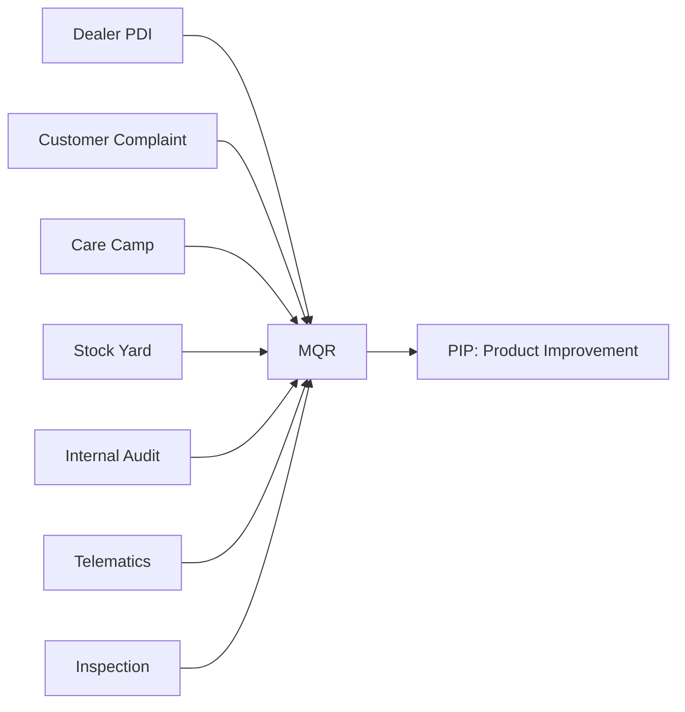

# 05 — Service & Quality Domains

## Service Domain

| Sub-domain | Module | Status |
|---|---|---|
| Registration | NTR | Shipped |
| Maintenance | PM | Shipped |
| Warranty | *(currently computed, not a standalone module)* | `calcWarranty()` exists; no dedicated Warranty module/table yet — see 14 |
| Parts | *(not built)* | `parts` table exists per root `CLAUDE.md` §5 ("not yet wired into the UI") |
| Quality | MQR, PIP | MQR shipped; PIP is new (below) |

Each remains its own bounded context (02) — this document does not
propose merging them. What it proposes is that all five emit into the
same Event Model (06) so Machine Timeline/Knowledge/Analytics see one
consistent picture instead of five bespoke ones.

## Quality Domain

### Where quality problems originate



Every one of these sources is a distinct *origin*, but they should all
funnel into the **same MQR intake**, not seven parallel quality-entry
mechanisms — MQR's `problem_code`/`severity`/`stockNote` fields already
support "how was this found" as a field (`stockNote` today captures
where a vehicle came from when it's not a normal customer report,
per root `CLAUDE.md` §8.6). Formalizing "origin" as a first-class,
enumerated field (rather than free text) is the concrete gap — tracked
in 14, not solved here.

### MQR vs. PIP — the actual boundary

- **MQR captures Field Quality Problems.** One report, one machine, one
  incident. This is exactly what MQR already does today — nothing about
  MQR's own scope changes.
- **PIP manages Product Improvement execution.** A PIP is not "a bigger
  MQR" — it's a *response* to a pattern across many MQR reports (and
  potentially Inspection/Telematics data too), tracking an engineering
  change from root-cause confirmation through fielded fix. A PIP
  references N MQR reports (and other evidence), not the reverse.

```
MQR (N reports, one machine each)
   \
    \  pattern detected (manually today; AI-assisted candidate — see 08)
     \
      PIP (1 improvement initiative)
        ├── linked MQR reports (evidence)
        ├── linked Inspection results (evidence)
        ├── Root Cause (from ORC investigation, below)
        ├── Corrective Action
        └── Effectiveness tracking (repeat-failure-rate after fix ships)
```

### ORC — an internal workflow, not a module

**ORC should not become a standalone module.** Treat it as an internal
engineering investigation workflow that *supports* PIP, not a peer of
MQR/PM/NTR:

- Root Cause Analysis
- Corrective Actions
- AI Knowledge (references Knowledge domain, 07, for similar-case
  retrieval during the investigation)
- PIP decisions (an ORC investigation's output is the evidence a PIP
  decision is made from)

Concretely: ORC is a *process* (and, if it needs persistence at all, a
handful of fields attached to a PIP record — root cause text, evidence
links, decision log) — not its own table family, not its own bounded
context, not its own API surface. This mirrors the Activity Timeline
spec's own original example ("Warranty Decision, ORC Number" as a
*pinned event* on a record's timeline, not a separate module) — ORC
Number is a reference stamped onto the record it investigates, not an
independent aggregate.

## Service architecture summary

```
NtrService / MaintenanceService / MqrService (existing, per-context)
      │
      ▼ emits
Event Model (06)
      │
      ├──▶ Machine Timeline (03)
      ├──▶ Knowledge (07)
      └──▶ Analytics (09)

PIP (new, features/pip/)
  ├── PipService — create/update a PIP, link evidence (MQR reports, Inspections)
  └── PipRepository — owns a new, additive `pip_records` table (11)

Warranty / Parts (not yet first-class modules — out of scope to design
  in detail here; flagged in 14 as a prerequisite for a real Warranty
  Activated event in the Machine Lifecycle, 03)
```

## What this document deliberately does not do

- It does not design the `parts`/Warranty table schemas in detail — they
  don't exist as real modules yet, and designing their full schema
  without a confirmed business requirement would be exactly the kind of
  speculative work `PLATFORM_CONSTITUTION.md`'s "Architecture Evolution
  Rule" warns against.
- It does not decide how quality-problem "origin" gets captured
  structurally (new enum column vs. reusing `stockNote`) — a real
  decision, deferred to implementation time with the business, not
  guessed here.
