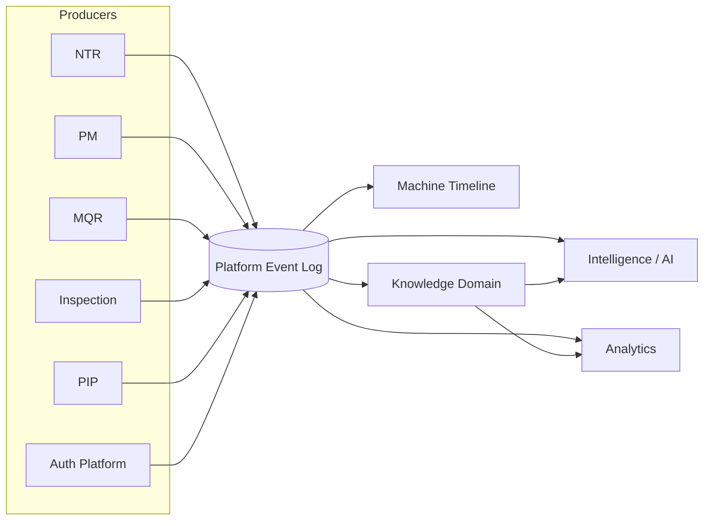

# 06 — Event Model & Flow

## Everything important is an Event

This platform already has **two** independent, real implementations of
"an event" — this document's job is to name the generalization that
unifies them, not invent a third:

| | `record_audit_log` (shipped, all business modules) | `auth_audit_log` (shipped, Authentication Platform v3.0) |
|---|---|---|
| Scope | Business record changes (mqr/pm/ntr) | Auth/session/account events |
| Shape | `module, record_id, record_ref, event_type, field_name, old_value, new_value, performed_by, performed_at` | `event_type, username, user_id, ip_address, user_agent, metadata, created_at` |
| Consumer today | `mapAuditLogToActivityEvents.ts` → Activity Timeline | Nothing yet (write-only log) |

Both are already "one system-logged entry per business event" (the
`record_audit_log` doc comment's own words) — both are append-only,
both are already the right shape to be read by more than one consumer.
**The gap is not the event mechanism. The gap is that only one of them
has a second consumer today (the Timeline), and neither feeds Knowledge
or Analytics yet.**

## Platform Event envelope (proposed superset)

```ts
interface PlatformEvent {
  event_id: string;
  event_type: PlatformEventType;      // see catalog below
  machine_id: string | null;          // Machine reference — null only for non-Machine events (e.g. USER_INVITED)
  entity_type: string;                // 'mqr' | 'pm' | 'ntr' | 'inspection' | 'pip' | 'machine' | 'auth' | ... - additive union, see 11
  entity_id: string;
  performed_by: string;
  performed_at: string;               // ISO, GMT+7 display via the existing thaiDate.ts convention
  summary: string;
  changes: FieldChange[] | null;
  metadata: Record<string, unknown>;  // forward-compatible bag, same convention ActivityEvent.metadata already uses
}
```

This is deliberately close to `ActivityEvent` (Activity Timeline's shape)
— that component was explicitly designed so "future event sources
(MQR/PM/Warranty/ORC/Parts/Campaign/Delivery/NTR/Vehicle
Registration/Owner Transfer) [work] without redesign." `PlatformEvent`
*is* that future-proofing being exercised, not a new component.

## Event Catalog (representative, not exhaustive — additive per 01 Principle 2)

```
Machine Imported                Ownership Changed
Import PDI Completed            NTR Created
Dealer PDI Completed            Warranty Activated
Customer Delivery               PM Completed
MQR Created / Opened / Closed   PIP Created / Completed
Inspection Completed            Knowledge Case Created / Updated
Session events (already shipped: SESSION_CREATED, SESSION_REVOKED, ...)
Auth events (already shipped: LOGIN_SUCCESS, ACCOUNT_LOCKED, ...)
```

New event types are always additive — a new module adds new
`PlatformEventType` values and a new `entity_type`, never a redesign of
the envelope. This is the same additive-only guarantee already verified
for `ActivityEventType` (Activity Timeline's final review explicitly
confirmed "future event types should be additive only").

## Event Flow Diagram



- **Producers never call consumers directly.** MQR does not know
  Knowledge exists; it writes an event. This is already true today
  (`record_audit_log` has no consumer-awareness baked in) — the flow
  diagram just names the pattern platform-wide.
- **The event log is the integration point, not a message broker.** No
  new infrastructure (Kafka/SQS/etc.) is proposed — "Platform Event Log"
  can, for the phases in 13 that need it, literally *be*
  `record_audit_log` + `auth_audit_log` + new per-domain tables, read by
  a small number of scheduled/on-demand consumers (a Knowledge-building
  job, an Analytics refresh), exactly like `mapAuditLogToActivityEvents`
  already reads `record_audit_log` synchronously today. A real message
  bus is a Phase 7/8 (13) conversation once event volume and consumer
  count justify it — not a prerequisite to start.

## How each domain consumes events

- **Timeline (03)** consumes events synchronously, on page render — no
  change to today's pattern, just more event sources.
- **Knowledge (07)** consumes events to build/update cases — can be
  synchronous (on write) or batched (nightly job); either is compatible
  with this envelope, the choice is an implementation detail for
  whichever phase actually builds Knowledge (13's Phase 3).
- **Analytics (09)** consumes Knowledge, not raw events directly, per 01
  Principle 9 and 09's own scope note.
- **AI (08)** consumes Knowledge, never raw events directly — this is
  intentional and load-bearing: Intelligence must never become a second
  interpretation of raw data independent from Knowledge, or two systems
  end up disagreeing about what a symptom means.

## Explicitly not designed here

- The exact mechanism for "batched vs. synchronous" event consumption
  per domain — that's an implementation decision made per-phase (13),
  not a platform-wide mandate.
- Whether `record_audit_log`/`auth_audit_log` get literally merged into
  one table, or stay separate with a shared read-shape — see 11's
  Database Evolution Strategy for that specific fork.
