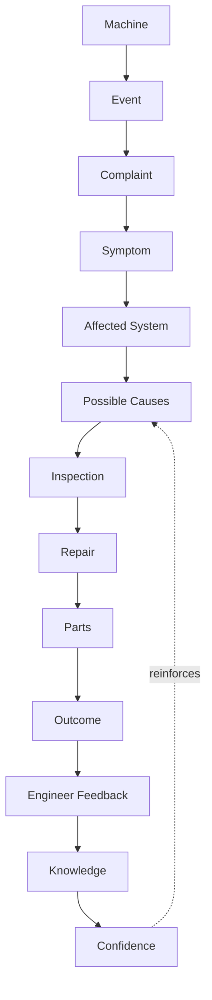
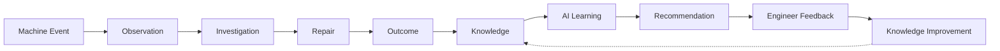

# 07 — Knowledge Domain & Graph

## Knowledge is created from

Import PDI, Dealer PDI, PM, Warranty, MQR, PIP, Repairs, Parts, Timeline,
Engineer Feedback — i.e. every domain in this blueprint, via the Event
Model (06). **Knowledge must be reusable. Knowledge never belongs to one
module.** This is the single most important architectural boundary in
this entire blueprint: if a "Knowledge" table ends up with a foreign key
to `records.id` (MQR's own table) as its primary way of being found, it
has silently become MQR's knowledge, not the platform's — the same
mistake this blueprint's North Star (01) explicitly warns against.

## Knowledge Graph



Read this graph as a **case**, not a table row: one Knowledge Case is the
path from a specific Machine's specific Event through to a Confidence
score, and multiple cases sharing the same Symptom → Affected System →
Cause path is exactly the pattern-detection Knowledge exists to surface
(and exactly what feeds "Similar Case Retrieval" in 08).

## Knowledge Model (proposed, additive-only — no migration in this PR)

```ts
interface KnowledgeCase {
  id: string;
  // Provenance — never a foreign key to one module's table; always a
  // reference to the generic Platform Event that created/updated this case.
  source_events: string[];          // PlatformEvent.event_id references (06)
  machine_context: {
    product_family_id: string | null;
    model: string | null;
    // Deliberately NOT machine_id/serial as the primary key of a case -
    // a case generalizes ACROSS machines of the same family/model. The
    // specific machines that contributed evidence live in source_events.
  };
  symptom: string;
  affected_system: string;          // reuses the existing problem_codes.system taxonomy (powertrain/other) as a starting point, extended as needed
  possible_causes: { cause: string; confidence: number }[];
  repair_summary: string | null;
  parts_used: string[] | null;      // part numbers, once Parts (05) is a real module
  outcome: 'Resolved' | 'Unresolved' | 'Recurred';
  confidence: number;               // 0-1, computed from corroborating cases + engineer feedback (see Lifecycle below)
  engineer_feedback: { username: string; rating: 'Helpful' | 'NotHelpful'; note: string | null; at: string }[];
  created_at: string;
  updated_at: string;
}
```

Design choices:

- **`machine_context` is a family/model, not a specific serial.** A
  Knowledge Case's *value* is exactly that it applies to the next
  machine of the same type, not just the one it was learned from — this
  is the literal meaning of "every piece of knowledge should help solve
  the next machine faster" (01's Vision).
- **`confidence` is a first-class, stored field**, not computed on every
  read — because Evidence-First AI (08) needs to cite it instantly, and
  because "Knowledge continuously improves AI" (01 Principle 4) implies
  confidence is a value that *changes over time* as more cases
  corroborate or contradict it, which means it needs to be written, not
  just derived.
- **`engineer_feedback` lives on the case itself.** This is the
  mechanism behind Principle 5 ("Engineers continuously improve
  Knowledge") — feedback is not a separate, disconnected log; it's the
  input that moves `confidence`.

## Knowledge Lifecycle



This loop is the platform's actual product, more than any individual
screen: **Machine Event → Observation → Investigation → Repair →
Outcome → Knowledge → AI Learning → Recommendation → Engineer Feedback →
Knowledge Improvement**, closing back on itself. Every phase in the
Roadmap (13) either builds one segment of this loop or strengthens an
existing segment — that's the test for whether a proposed feature
belongs in this platform at all (01's Engineering Principles).

## Knowledge Service Architecture

```
KnowledgeService (new, features/knowledge/)
  ├── createOrUpdateCase(sourceEvent)   — called by the Event consumers (06)
  ├── recordFeedback(caseId, feedback)  — the loop-closing write
  ├── findSimilarCases(symptom, machineContext) — the read path Intelligence (08) depends on
  └── KnowledgeRepository — owns the new `knowledge_cases` table (11), never queried directly by Intelligence/Analytics
```

Matches the "Open Host Service" relationship named in 02's Context Map:
Intelligence and Analytics both depend on `KnowledgeService`'s public
methods, never on `knowledge_cases` directly.

## Explicitly not designed here

- The actual matching/clustering algorithm behind
  `createOrUpdateCase`/`findSimilarCases` (rule-based vs. embedding-based
  similarity) — that's an Intelligence-domain implementation detail
  (08), and per this PR's explicit "do not select LLM vendors, do not
  design prompts" scope boundary, not decided here either way.
- Whether `knowledge_cases` starts as a Postgres table (consistent with
  everything else in this platform) or something else — 11 recommends
  Postgres for the same reason every other domain in this platform
  already uses it (no new infrastructure without a confirmed need), but
  a vector-similarity requirement in Phase 4+ (13) may justify a
  dedicated vector store *alongside* Postgres later — flagged as a
  future decision point in 14, not resolved now.
