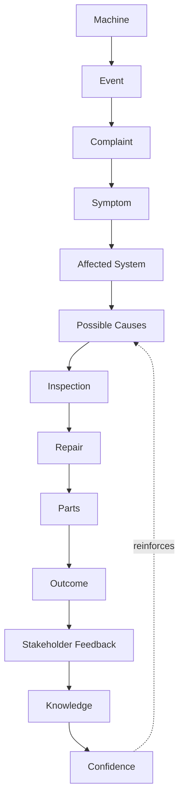
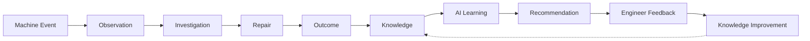

# 07 — Knowledge Domain & Graph

> **Amendment (ADR-018, Engineering Knowledge Platform)**: this chapter's
> proposed `KnowledgeCase.confidence` (continuous `0-1`, computed) and
> Knowledge Maturity stage names (Draft/Validated/Trusted/Best Practice/
> Retired) are **superseded** by `docs/adr/ADR-018-Knowledge-Model.md` and
> `docs/architecture/KNOWLEDGE_PLATFORM.md` §5/§3 - discrete manual
> Confidence levels (VeryLow/Low/Medium/High/Verified) and a five-stage
> Maturity of Draft/Review/Published/Deprecated/Archived. This chapter's
> content below is preserved as the historical record of the original
> proposal and remains authoritative for everything ADR-018 did **not**
> change: the single-`KnowledgeCase`-entity model, the ownership boundary
> ("Knowledge never belongs to one module," "Machine never owns
> Knowledge"), the Human Feedback Loop's authority rule (only an Engineer
> moves confidence, never AI), and the deferred matching/clustering
> algorithm. Read this chapter for the *why*; read the Knowledge Platform
> doc for the *current, implemented* field names and values.

## Knowledge is created from

Import PDI, Dealer PDI, PM, Warranty, MQR, PIP, Repairs, Parts, Timeline,
and Human Feedback (Technician, Dealer, Customer, and Engineer — see the
Human Feedback Loop below) — i.e. every domain in this blueprint, via the
Event Model (06). **Knowledge must be reusable. Knowledge never belongs
to one module.** This is the single most important architectural boundary in
this entire blueprint: if a "Knowledge" table ends up with a foreign key
to `records.id` (MQR's own table) as its primary way of being found, it
has silently become MQR's knowledge, not the platform's — the same
mistake this blueprint's North Star (01) explicitly warns against.

## Knowledge Graph



Read this graph as a **case**, not a table row: one Knowledge Case is the
path from a specific Machine's specific Event through to a Confidence
score, and multiple cases sharing the same Symptom → Affected System →
Cause path is exactly the pattern-detection Knowledge exists to surface
(and exactly what feeds "Similar Case Retrieval" in 08).

## Knowledge Model (proposed, additive-only — no migration in this PR)

```ts
interface KnowledgeCase {
  id: string;
  // Provenance — never a foreign key to one module's table; always a
  // reference to the generic Platform Event that created/updated this case.
  source_events: string[];          // PlatformEvent.event_id references (06)
  machine_context: {
    product_family_id: string | null;
    model: string | null;
    // Deliberately NOT machine_id/serial as the primary key of a case -
    // a case generalizes ACROSS machines of the same family/model. The
    // specific machines that contributed evidence live in source_events.
  };
  symptom: string;
  affected_system: string;          // reuses the existing problem_codes.system taxonomy (powertrain/other) as a starting point, extended as needed
  possible_causes: { cause: string; confidence: number }[];
  repair_summary: string | null;
  parts_used: string[] | null;      // part numbers, once Parts (05) is a real module
  outcome: 'Resolved' | 'Unresolved' | 'Recurred';
  confidence: number;               // 0-1, computed from corroborating cases + stakeholder feedback (see Human Feedback Loop below)
  feedback: {
    username: string;
    role: 'Technician' | 'Dealer' | 'Customer' | 'Engineer';
    rating: 'Helpful' | 'NotHelpful';
    note: string | null;
    validated: boolean;              // true only for an Engineer entry that has gone through Engineer Validation — see Human Feedback Loop
    at: string;
  }[];
  created_at: string;
  updated_at: string;
}
```

Design choices:

- **`machine_context` is a family/model, not a specific serial.** A
  Knowledge Case's *value* is exactly that it applies to the next
  machine of the same type, not just the one it was learned from — this
  is the literal meaning of "every piece of knowledge should help solve
  the next machine faster" (01's Vision).
- **`confidence` is a first-class, stored field**, not computed on every
  read — because Evidence-First AI (08) needs to cite it instantly, and
  because "Knowledge continuously improves AI" (01 Principle 4) implies
  confidence is a value that *changes over time* as more cases
  corroborate or contradict it, which means it needs to be written, not
  just derived.
- **`feedback` lives on the case itself, from every stakeholder who
  touched the underlying event — not only engineers.** This is the
  mechanism behind Principle 5 ("Everyone who touches a Machine
  continuously improves Knowledge") — feedback is not a separate,
  disconnected log; it's the input that moves `confidence`. See the
  Human Feedback Loop below for why `validated` exists and who can set
  it.

## Knowledge Lifecycle



This loop is the platform's actual product, more than any individual
screen: **Machine Event → Observation → Investigation → Repair →
Outcome → Knowledge → AI Learning → Recommendation → Engineer Feedback →
Knowledge Improvement**, closing back on itself. Every phase in the
Roadmap (13) either builds one segment of this loop or strengthens an
existing segment — that's the test for whether a proposed feature
belongs in this platform at all (01's Engineering Principles).

## Human Feedback Loop

Feedback is not engineer-only. Every stakeholder who interacts with a
Machine or a Knowledge Case's recommendation can contribute an
observation, but not every stakeholder's feedback carries the same
authority:

| Stakeholder | What they feed back | Effect on `confidence` |
|---|---|---|
| **Technician Feedback** | Did the suggested repair/inspection step actually apply in the field? | Corroborating signal — nudges confidence, never alone decisive |
| **Dealer Feedback** | Was the recommendation practical at the dealer's actual parts/skill level? | Corroborating signal, same weight class as Technician |
| **Customer Feedback** | Did the repair resolve the complaint from the customer's perspective (no repeat visit)? | Corroborating signal — the closest proxy this platform has to a real-world outcome check |
| **Engineer Validation** | Confirms (or rejects) that the root cause and recommendation were actually correct | **The only feedback type that can raise or lower a Knowledge Case's stored `confidence` value directly** |

This is not a demotion of Technician/Dealer/Customer input — it is the
same AI Governance boundary from 08 applied to Knowledge instead of to a
recommendation: **more voices can observe, only an Engineer can
validate.** A Knowledge Case can accumulate any number of unvalidated
`feedback` entries (`validated: false`) that Engineering Intelligence
(08) may still surface as supporting color ("3 technicians confirmed
this step worked"), but `confidence` itself only moves on an
`Engineer Validation` event (`validated: true`) — matching 01 Principle
6 ("AI assists engineers, AI never replaces engineering judgment")
extended to say a *dealer or customer* opinion doesn't silently become
platform-trusted knowledge either, without an engineer's confirmation.

## Knowledge Score

**Concept only — not an implementation.** Every Machine (via its
Machine Digital Passport, 10) has a Knowledge Score: a single, explained
indicator of *how much reliable knowledge this platform actually has
about this specific machine*, not a quality or health score for the
machine itself.

Knowledge Score reflects:

- Completeness of lifecycle (03) — how many expected stages actually have
  a recorded event (a machine missing its Dealer PDI has a real gap, not
  just an old record)
- Inspection history (04) — how many inspections exist, and how recent
  they are
- Repair history — resolved vs. unresolved vs. recurred outcomes on this
  machine's own Knowledge Cases (07)
- PM history — maintenance compliance/frequency
- Quality history — MQR/PIP involvement and resolution
- Engineer feedback — how much of this machine's contributing Knowledge
  has actually passed Engineer Validation (above), vs. still-unvalidated
  stakeholder feedback
- Confidence of available knowledge — the aggregate `confidence` (07's
  `KnowledgeCase.confidence`) of the Knowledge Cases this machine's
  history has contributed to or matches

**How AI may use it**: Engineering Intelligence (08) may use a machine's
Knowledge Score to adjust how *confidently* it presents a recommendation
for that specific machine — a machine with a thin, incomplete history
should produce a more hedged recommendation (per 08's AI Confidence
Policy) even when a matched Knowledge Case itself has high confidence,
because the case's applicability *to this machine* is less certain than
its applicability in general. Knowledge Score adjusts presentation
confidence only — it never gates whether a recommendation is shown, and
it never substitutes for a Knowledge Case's own `confidence` field; the
two are deliberately separate numbers answering separate questions ("how
much do we trust this pattern" vs. "how much do we know about *this*
machine").

## Knowledge Maturity

**Knowledge Confidence != Knowledge Maturity.** These are two different
numbers/values answering two different questions, and conflating them is
a real risk (14):

- **Confidence** (`KnowledgeCase.confidence`, above) answers *"how sure
  are we this cause/fix is correct?"* — it can move quickly: one strong,
  Engineer-validated case can already carry high confidence.
- **Maturity** answers *"how proven and institutionalized is this
  knowledge over time and across machines?"* — it can only advance
  slowly, through repeated corroboration and usage, never through a
  single validation event alone.

A Knowledge Case moves through five maturity stages:

| Stage | Meaning |
|---|---|
| **Draft** | Newly created from a single source event or observation — not yet corroborated |
| **Validated** | At least one Engineer Validation (07's Human Feedback Loop) confirms the case is correct |
| **Trusted** | Corroborated across multiple independent machines/dealers/occurrences, not just re-confirmed once |
| **Best Practice** | Proven enough, over enough time and repair volume, that Engineering Intelligence (08) can present it as institutional guidance, not just a matched case |
| **Retired** | Superseded — e.g. a PIP (05) shipped a fix so the symptom is not expected to recur, or the affected product line is discontinued. Retired cases are never deleted (matching this platform's existing soft-delete convention, root `CLAUDE.md` §8.5) — they remain queryable for historical/audit purposes, just excluded from active recommendation matching |

**A case can have high confidence and low maturity at the same time** —
a single, well-validated observation on one machine is trustworthy
enough to confidence-score highly, but has not yet been proven across
enough machines/time to be a Best Practice. Engineering Intelligence (08)
should account for both independently: confidence affects the AI
Confidence Policy's presentation band; maturity affects whether a
recommendation is framed as "one validated case" versus "established
best practice" — a wording distinction, matching 08's own principle that
confidence-related language must never imply authorization it doesn't
have.

## Knowledge Service Architecture

```
KnowledgeService (new, features/knowledge/)
  ├── createOrUpdateCase(sourceEvent)   — called by the Event consumers (06)
  ├── recordFeedback(caseId, feedback)  — the loop-closing write
  ├── findSimilarCases(symptom, machineContext) — the read path Engineering Intelligence (08) depends on
  └── KnowledgeRepository — owns the new `knowledge_cases` table (11), never queried directly by Engineering Intelligence/Analytics
```

Matches the "Open Host Service" relationship named in 02's Context Map:
Engineering Intelligence and Analytics both depend on `KnowledgeService`'s
public methods, never on `knowledge_cases` directly.

## Explicitly not designed here

- The actual matching/clustering algorithm behind
  `createOrUpdateCase`/`findSimilarCases` (rule-based vs. embedding-based
  similarity) — that's an Engineering Intelligence-domain implementation
  detail (08), and per this PR's explicit "do not select LLM vendors, do
  not design prompts" scope boundary, not decided here either way.
- Whether `knowledge_cases` starts as a Postgres table (consistent with
  everything else in this platform) or something else — 11 recommends
  Postgres for the same reason every other domain in this platform
  already uses it (no new infrastructure without a confirmed need), but
  a vector-similarity requirement in Phase 4+ (13) may justify a
  dedicated vector store *alongside* Postgres later — flagged as a
  future decision point in 14, not resolved now.
