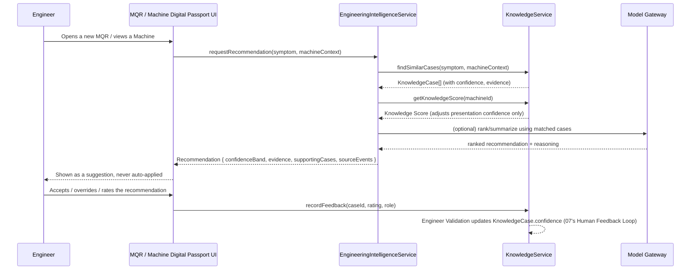

# 08 — Engineering Intelligence (AI) Architecture

**Out of scope, explicitly, per this PR's brief**: no LLM vendor
selection, no prompt design. This document describes the *service
architecture and governance* AI operates inside, not which model answers
a request or how it's asked.

## Why "Engineering" Intelligence, not just "Intelligence"

This domain was named plain "Intelligence" in the prior revision of this
blueprint. That name is ambiguous — "Intelligence" alone reads as general
business intelligence (dashboards, reporting), which is Analytics' job
(09), not this domain's. Renamed to make the boundary explicit: **this
domain exists to support engineering decisions — diagnosis, root cause,
repair — not to report on the business.**

```
Knowledge
   ↓
Engineering Intelligence
   ↓
Analytics
```

Engineering Intelligence sits between Knowledge and Analytics in the
pipeline, but the arrow direction matters: it *consumes* Knowledge (07)
to produce engineering recommendations, and its predictive outputs may
in turn feed Analytics (09's one Intelligence → Analytics exception, e.g.
Predictive Quality Analytics) — it does not sit *inside* Analytics, and
Analytics does not sit inside it. Two different questions, two different
domains: "what should an engineer do about this machine" (Engineering
Intelligence) vs. "what does the business's aggregate data show"
(Analytics).

## AI is a Decision Support System

**AI never becomes the decision maker.** This is not a phased-in
constraint that loosens later — it is a permanent architectural
boundary, restated here so every phase in 13 that touches Engineering
Intelligence is built against it from the start.

## AI Governance

AI **never**:

- approves warranty
- approves repairs
- creates a PIP automatically
- changes records
- approves engineering decisions

AI **only** provides:

- Evidence
- Recommendations
- Confidence
- Supporting cases
- Inspection suggestions
- Repair suggestions
- Required parts
- Estimated repair time
- Knowledge references

**Engineers make all final decisions.** Enforced architecturally, not
just by policy: every write path that could result from an AI
recommendation (closing an MQR, creating a PIP, approving a warranty
claim) goes through the same existing human-authored API routes and
RBAC checks (`scope.ts` predicates) that exist today — Engineering
Intelligence never gets its own privileged write path. A recommendation
is a suggested *input* to a form a human still submits, never a
background job that mutates a record.

## Evidence-First AI

Every recommendation must include:

| Element | Source |
|---|---|
| Confidence | `KnowledgeCase.confidence` (07), adjusted in presentation strength by the machine's Knowledge Score (07) |
| Evidence / Reasoning | The specific fields of the matched Knowledge Case(s) that justify the recommendation |
| Supporting cases | `KnowledgeCase.source_events` (07) — resolvable back to real Machine events, not synthesized examples |
| Repair success rate | Derived from `KnowledgeCase.outcome` across all matched cases |
| Inspection steps | From Inspection (04) checklist templates associated with the matched cause |
| Required parts | From `KnowledgeCase.parts_used` (07) |
| Source events | `PlatformEvent.event_id`s (06) — the literal audit trail |
| Knowledge references | `KnowledgeCase.id`s, linkable back into the Knowledge UI |

**No black-box recommendations.** If a recommendation cannot be traced to
at least one real Knowledge Case and its source events, the architecture
does not allow it to be shown as a recommendation — it would have to be
labeled as something else (e.g. "no similar cases found"), never
presented with false confidence.

## AI Confidence Policy

An architectural policy, not a per-feature choice — every capability
below presents its output through the same four confidence bands:

| Confidence | Label | Meaning |
|---|---|---|
| > 95% | **Strong Recommendation** | Multiple corroborating, Engineer-validated Knowledge Cases; safe to lead with this as the primary suggestion |
| 80–95% | **Recommendation** | Solid match, presented as a suggestion an engineer should seriously weigh |
| 60–80% | **Possible Cause** | Plausible, worth investigating, explicitly framed as one hypothesis among others |
| < 60% | **Request More Evidence** | Not enough corroborating Knowledge to recommend anything — the UI asks for more diagnostic input instead of guessing |

**This policy affects recommendation strength and wording only. It never
authorizes an automated decision at any confidence level, including
100%.** A "Strong Recommendation" is still a suggested input to a form an
engineer submits, subject to the same AI Governance boundary above — the
bands change how confidently the UI *phrases* a suggestion, never whether
a write path requires a human. A machine's Knowledge Score (07) can move
a recommendation between bands (e.g. down from "Strong Recommendation" to
"Recommendation") when the matched case is strong in general but this
specific machine's own history is too thin to fully vouch for it — see
07's Knowledge Score for that adjustment mechanism.

## Capabilities (named, not designed to implementation level)

Problem Classification · Symptom Extraction · Root Cause Ranking ·
Similar Case Retrieval · Troubleshooting Recommendation · Inspection
Recommendation · Repair Recommendation · Required Parts Recommendation ·
Repair Time Estimation · Warranty Risk Prediction · Quality Trend
Detection · Dealer Performance Insight · Technician Assistant · Knowledge
Summarization · PIP Recommendation · Predictive Quality Analytics.

Every one of these reads from `KnowledgeService` (07) and/or `Analytics`
(09) — none reads raw operational tables directly (01 Principle 4: "The
Engineering Intelligence domain has no independent data of its own").

## AI Service Architecture

```mermaid
flowchart TD
    UI[Engineer-facing UI\ne.g. MQR detail, Machine Digital Passport] -->|request: symptom + machine context| EISvc[EngineeringIntelligenceService]
    EISvc -->|read| KnowSvc[KnowledgeService]
    EISvc -->|read| AnalyticsSvc[AnalyticsService]
    EISvc -->|model call\n(vendor TBD - out of scope)| ModelGateway[Model Gateway]
    ModelGateway --> EISvc
    EISvc -->|Recommendation + Evidence + Confidence Band| UI
    UI -->|stakeholder feedback| KnowSvc
```

- **`EngineeringIntelligenceService`** is the *only* thing that calls a
  model provider. UI code never calls a model directly — same "thin
  controller, service owns the logic" convention already used
  everywhere in this codebase (Authentication Platform v3.0's
  `authServices/*`, Attachment Platform's `AttachmentService`).
- **`ModelGateway`** is a placeholder boundary, deliberately unspecified
  (no vendor, no prompt) — its only architectural job is to be the one
  swappable seam if the model/vendor changes later, so that decision
  never touches `EngineeringIntelligenceService`'s callers.
- **Feedback writes go through `KnowledgeService`, not
  `EngineeringIntelligenceService`.** Engineering Intelligence is a
  reader of Knowledge, not a writer of it directly — feedback (from any
  stakeholder, per 07's Human Feedback Loop) is knowledge-domain data, so
  it's Knowledge's repository that persists it (07), keeping the
  Customer/Supplier relationship from 02's Context Map intact.

## AI Decision Support Flow



The loop closes through `KnowledgeService`, exactly matching 07's
Knowledge Lifecycle diagram — this sequence is that lifecycle's UI-level
realization, not a separate design.

## Explicitly not decided here

- Model/vendor selection (OpenAI/Anthropic/self-hosted/etc.) — out of
  scope per this PR's brief.
- Prompt design/templates — out of scope per this PR's brief.
- The exact formula behind Knowledge Score or how it numerically
  discounts a confidence band — 07 defines the concept only; the
  computation is an implementation decision for whichever phase (13)
  actually builds it.
- Whether `ModelGateway` calls happen synchronously in the request path
  or via a queued job — an implementation detail for whichever Phase
  (13) actually builds this, likely synchronous-with-timeout to start,
  given this platform has no existing job-queue infrastructure and
  Principle 9 argues against adding one before a real need is confirmed.
