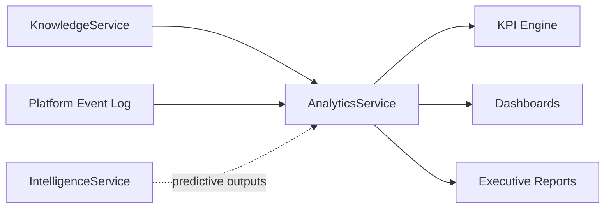

# 09 — Analytics Architecture

**Out of scope, explicitly**: no Data Warehouse implementation. This
document is the architecture Analytics operates inside, not a DW product
selection or schema.

## Analytics consumes Knowledge. Not operational tables.

This is the one rule this document exists to enforce. Today's dashboard
(`dashboardStats()` in `lib/db.ts`) computes KPIs directly from
operational tables (`records`, `pm_records`, `ntr_records`) — that
remains true and fine for *today's* current-state KPIs (open/closed
counts, SLA breach counts — genuinely operational, not knowledge-derived
questions). The distinction this blueprint draws is about a different
class of question:

| Question type | Answered from | Example |
|---|---|---|
| Operational ("what's happening right now") | Operational tables directly — unchanged, today's `dashboardStats()` pattern is correct for this | "How many MQRs are open today?" |
| Knowledge-derived ("what does this tell us") | Knowledge domain (07), never a raw table scan | "Which failure mode has the worst first-time-fix rate this quarter?" |

Analytics as a *domain* (in the DDD sense, 02) is specifically the second
category — the KPI/dashboard/report layer described below reads
`KnowledgeService` and the Event Model (06), and does not duplicate
`dashboardStats()`'s existing, correct, direct-query approach for
day-to-day operational counts.

## Scope

- KPI computation
- Dashboards
- Executive Reports
- Machine Reliability (derived from Knowledge outcomes + repeat-failure
  events)
- Dealer Performance (derived from Inspection results, MQR resolution
  time, PM compliance — all already-emitted events per 06)
- Warranty Cost (derived from Warranty Activated/Claim events, once
  Warranty is a real module — 05, 14)
- Trend Analysis
- PIP Effectiveness (repeat-failure-rate before/after a PIP ships — 05)
- Predictive Quality (consumes Intelligence's Quality Trend
  Detection/Predictive Quality Analytics outputs, 08 — Analytics is
  itself also a *consumer* of Intelligence for this one capability,
  which is the one place the arrow in 02's Context Map runs
  Intelligence → Analytics instead of the more common Knowledge →
  Analytics)

## Architecture

- **`AnalyticsService`** (new, `features/analytics/`) is the only thing
  that reads `KnowledgeService`'s aggregate-level methods and the event
  log for trend computation — mirroring every other domain's
  service-owns-the-reads convention.
- **No new database technology is proposed.** Every KPI in this
  blueprint's Success Metrics (01) is computable from Postgres
  aggregate queries over the Event Model + Knowledge tables — the same
  approach `dashboardStats()` already uses today for its own scope, just
  reading different (Knowledge-shaped) tables for the knowledge-derived
  questions. A dedicated OLAP/warehouse product is explicitly out of
  scope for this PR and is a Phase 7+ (13) conversation once real data
  volume justifies it, not before.

## Relationship to existing dashboard

`src/app/(app)/dashboard/`'s existing KPI dashboard is **not replaced**
by this design. It continues to answer today's operational questions
directly from `records`/`pm_records`/`ntr_records`, exactly as it does
now. `AnalyticsService` is additive — a new, separate set of
knowledge-derived views/reports, not a rewrite of the existing dashboard.
Whether the two eventually converge into one dashboard shell is a UI
decision for whichever phase (13) actually builds this, not an
architectural requirement of this blueprint.

## Explicitly not decided here

- Data Warehouse product/implementation — out of scope per this PR's
  brief.
- Whether Analytics gets its own materialized views/read replicas for
  performance — a scaling decision to make against real query load, not
  speculatively now (01 Principle 9, again).
