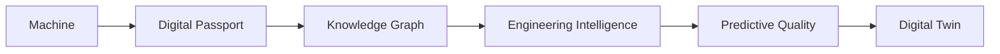

# 15 — Future Vision

**This chapter is deliberately speculative beyond 13's Roadmap.** Nothing
here is scheduled, scoped, or a commitment — it exists to show that the
domains this blueprint defines (02, 06, 07, 08) compose toward something
larger than the 8 phases in 13, without requiring this blueprint to
design that larger thing now.

## The long-term evolution

Reading this as a maturity progression, not a build order:

- **Machine → Digital Passport** — this blueprint's own Phase 1 (13):
  every machine gets a queryable, aggregated business object (10).
- **Digital Passport → Knowledge Graph** — Phase 3: Passports across many
  machines of the same family/model contribute to shared Knowledge Cases
  (07), which is what actually forms the graph in 07's Knowledge Graph
  diagram.
- **Knowledge Graph → Engineering Intelligence** — Phase 4–5: the graph
  becomes queryable for recommendations, root cause ranking, and the
  other capabilities named in 08.
- **Engineering Intelligence → Predictive Quality** — Phase 7: enough
  Knowledge + Event volume exists to trend and forecast quality issues
  before they're widely reported, not just diagnose them after the fact.
- **Predictive Quality → Digital Twin** — beyond this blueprint entirely
  (below).

## Digital Twin — explicitly outside the current roadmap

**A Digital Twin (a live, simulate-able virtual model of an individual
physical machine, typically fed by continuous IoT/telematics streams) is
named here only to show where the Future Integrations Readiness (12)
list — specifically IoT/Telematics/CAN Bus — would eventually lead if
pursued to its logical end. It is explicitly:**

- **Not in this blueprint's 8-phase Roadmap (13).**
- **Not designed at any level in this document** — no data model, no
  simulation architecture, no vendor.
- **Not a prerequisite for any phase in 13** — Phases 1–8 are complete
  and valuable on their own without ever reaching this point.
- **Contingent on real-world IoT/Telematics integration existing first**
  (12), which is itself undesigned and unscheduled.

This chapter's only job is honesty about direction: if this platform's
Knowledge/Engineering Intelligence/Analytics domains are built the way
this blueprint describes, a Digital Twin is a *coherent* future
destination, not an architectural dead end this blueprint would need to
be reworked to support. That is a test of this blueprint's own
principles (01), not a proposal to build one.
