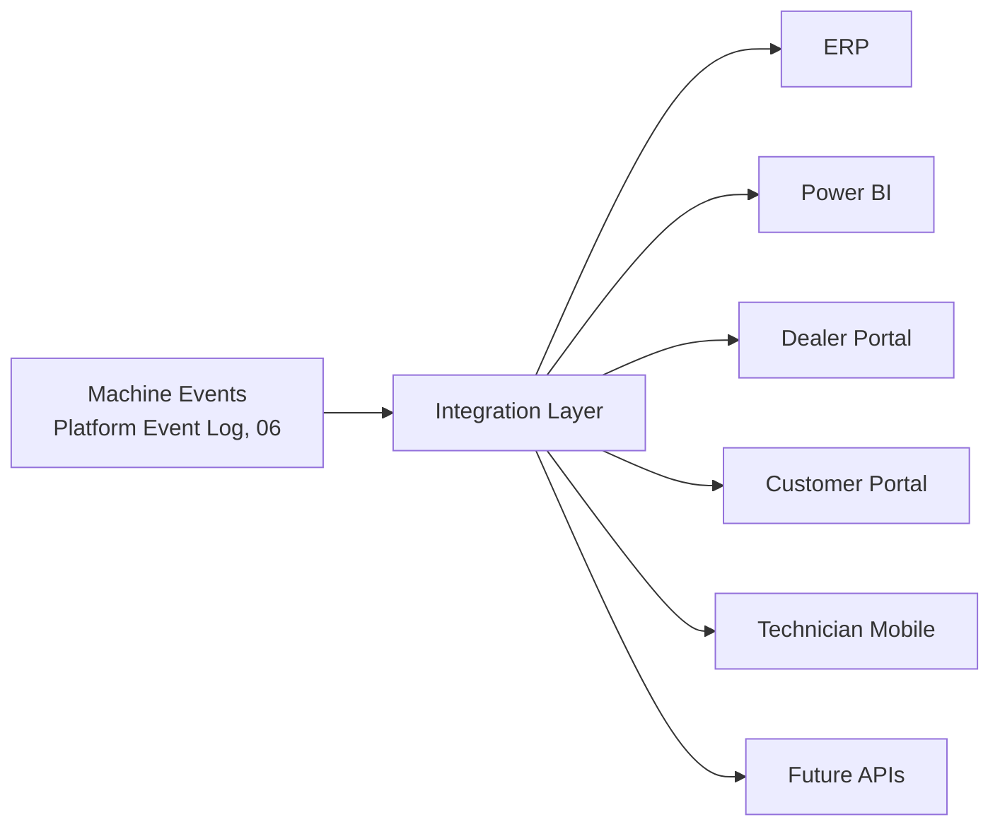

# 19 — Integration Boundary

12 already named the *pattern* each future integration would follow (new
event producer / new consumer of a service's read API / new client of
thin API routes). This document names the *layer* that makes that
consistent across every one of them, and states the one rule that layer
exists to enforce.

## The rule

**No external system should read internal business tables directly.**
Not Postgres credentials shared with an ERP, not a BI tool connected
straight to `vehicles`/`records`/`knowledge_cases`, not a mobile app
calling Supabase with its own service key. Every external system reads
through the Integration Layer, or it doesn't read at all.

## Integration Layer

The Integration Layer is not a new database, message broker, or gateway
product — consistent with 01 Principle 9 and every other domain in this
blueprint, it is **the existing service read-API surface, treated as a
formal boundary**: `KnowledgeService`, `AnalyticsService`,
`MachineService` (and the Platform Event Log itself, 06) are what every
external system actually reads, via the existing thin-controller/API
route convention (11 Rule 2/3) — never a raw table.

| External consumer | What it reads | Why not the raw table |
|---|---|---|
| ERP | Exported events/records (e.g. warranty cost data, 12) | ERP integrations are typically batch/file/API-based by nature; a raw DB connection would also bypass every RBAC/`applyScope()` boundary this platform enforces in application code (03's data-access-security rule), not just be architecturally inelegant |
| Power BI | `AnalyticsService`'s computed views, or a scheduled export (09, 12) | Prevents a second, drifting KPI implementation reading `records`/`pm_records` directly and disagreeing with the in-app dashboard |
| Dealer Portal | `MachineService`/`KnowledgeService` read paths, scoped by `DealerBranchScope` (12) | `DealerBranchScope` is the *only* dealer/branch authorization mechanism this platform has (root `CLAUDE.md` §6) — a portal with direct table access would need to reimplement that scoping itself, and get it wrong exactly once to leak cross-dealer data |
| Customer Portal | Same services, narrower scope (a customer's own machines only, 12) | Same reasoning as Dealer Portal, at an even more sensitive scope (an individual's own data) |
| Technician Mobile | Existing thin API routes (12) | Mobile-vs-web is a client concern (12) — the same route that serves the web UI is the same route that must authorize a mobile client, never a shortcut path |
| Future APIs | Whatever this catalog's events/services expose at that time | The whole point of naming this layer now — a future integration has one obvious place to plug in, not a fresh architectural decision each time |

## Why this is a boundary, not just a convention

This is the same class of rule as `DealerBranchScope`'s two-layer
enforcement (RLS + `applyScope()`, `.claude/rules/03-data-access-security.md`)
applied to *external* access instead of internal tenant isolation: a
single missed check anywhere is a real data leak, not a style nit. Naming
the Integration Layer explicitly means "should this new integration read
`vehicles` directly, just this once, it's faster" has an explicit answer
— no — before the question is ever asked in a design review (20's
Architecture Review).

## Explicitly not decided here

- Whether the Integration Layer ever becomes a literal separate
  service/gateway process, versus remaining "the existing services, used
  disciplined-ly" — a scaling decision to make only once a real
  integration volume justifies it (01 Principle 9), not speculatively now.
- Authentication/API-key mechanism for external systems (ERP, Power BI)
  — a real security design task for whichever phase actually builds that
  specific integration, not decided in this architecture-only document.
- Rate limiting / quota for external consumers — same reasoning as above.
